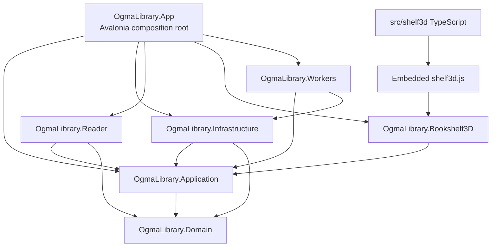
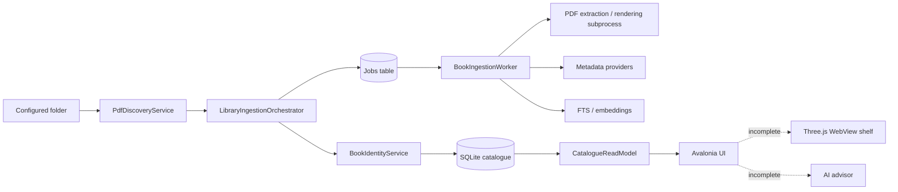

# Repository Map

## Snapshot

Audit baseline: commit `5514276fba5755335f754ad8db4c824783e9d6a4`, 20 August 2026. The repository is a .NET 10 modular-monolith desktop application built with Avalonia and SQLite. It targets Windows and macOS. A small TypeScript/Three.js bundle is intended to run inside the desktop application for the 3D shelf; it is not a separate web product.

| Area | Technology / location | Audit observation |
| --- | --- | --- |
| Solution/runtime | `OgmaLibrary.sln`, .NET SDK/runtime 10 | Restore/build succeed in locked mode on the audit workstation |
| Desktop presentation | `src/OgmaLibrary.App`, Avalonia 11.3.17 | Shell, catalogue, reader and several secondary views exist; navigation is incomplete |
| Domain | `src/OgmaLibrary.Domain` | Clean inward dependency, but file/work/edition semantics are not complete |
| Application | `src/OgmaLibrary.Application` | Use-case contracts and advisor orchestration; several services are not runtime-wired |
| Infrastructure | `src/OgmaLibrary.Infrastructure` | EF Core/SQLite, scanning, PDF, metadata, search, AI, LAN and security adapters |
| Workers | `src/OgmaLibrary.Workers` | Polling ingestion/index jobs; job lifecycle lacks durable leasing and rich recovery |
| Reader | `src/OgmaLibrary.Reader` | Page rendering/cache and reader support |
| 3D host | `src/OgmaLibrary.Bookshelf3D` | Bridge contracts and generated web asset; native host adapters are facades |
| 3D source | `src/shelf3d` | TypeScript, Three.js 0.181.2, esbuild; produces an embedded JS artifact |
| Data | `CatalogueDbContext`, 11 EF migrations | SQLite catalogue plus FTS/vector/AI/classroom tables; schema outruns workflows |
| Tests | three test projects | 800 tests: 637 core, 126 UI/headless, 37 architecture |
| CI | `.github/workflows/ci.yml` | Windows/macOS restore, format, analyzers, build, dependency scan, tests; release packaging absent |
| Documentation | `docs/` | Large historical plan corpus; latest controlled sources are 19 DOCX files in `docs/references/` |

Approximate first-party source inventory (generated directories excluded): 594 C# files / 86,714 lines, 18 AXAML files / 3,880 lines, 3 TypeScript files / 337 lines, 11 migrations, and 626 test method declarations.

## Project dependency structure

Architecture tests enforce the principal dependency rules. This is a real strength. The weakness is the oversized manual `CompositionRoot.cs`, which is responsible for too many infrastructure choices and still fails to bind several AI and 3D runtime adapters.

## Runtime data flow as implemented

The diagram is intentionally honest: registration, tables, and views exist, but the dotted connections are not complete production flows.

## Entry points and composition

- `src/OgmaLibrary.App/Program.cs` starts the Avalonia desktop process.
- `src/OgmaLibrary.App/App.axaml.cs` performs synchronous migration/startup work using blocking waits, risking slow or frozen startup.
- `src/OgmaLibrary.App/CompositionRoot.cs` manually constructs database, scanner, metadata, reader, LAN, search and partial AI services.
- `src/OgmaLibrary.Workers/BookIngestionWorker.cs` polls the database for generic jobs.
- `src/shelf3d/src/main.ts` is bundled to `src/OgmaLibrary.Bookshelf3D/Assets/Web/shelf3d.js`.

## Persistence map

The EF model contains books, files, works, editions, authors, tags, collections/shelves, metadata provenance/proposals, jobs, extracted pages/chunks, FTS, embeddings, AI audit/history, annotations/reading state, and classroom/LAN records. Important deficiencies:

- hash, size, modified time and fingerprint are primarily on `BookRow`, while `BookFileRow` lacks per-file content identity;
- work and edition tables exist without a complete population, reconciliation, merge/split or UI workflow;
- generic integer job/status fields replace explicit stage and failure-state contracts;
- vector rows do not capture the full extractor/chunker/prompt lifecycle needed for deterministic invalidation;
- cover assets exist but catalogue read models return `CoverRelativePath = null`.

## External and native boundaries

| Boundary | Purpose | Current state |
| --- | --- | --- |
| Google Books / Open Library | Bibliographic enrichment | Implemented adapters; persistent cache/quota/fallback policy incomplete |
| Ollama | Local completions/embeddings | Adapters exist; runtime and quality path incomplete |
| Cloud AI providers | Optional advisor | Provider abstractions exist; core gateway bindings and user configuration incomplete |
| PDF worker subprocess | Parse/render untrusted PDFs | Process separation exists; not an OS security sandbox |
| WebView2 / WKWebView | Host Three.js shelf | Contract/facades exist; no working adapter/bootstrap path found |
| DPAPI / Keychain | Secrets and classroom credentials | Platform adapters exist; full configuration lifecycle and physical validation incomplete |
| LAN HTTP/TLS/mDNS | Opt-in classroom host/client | Significant code and tests; no physical multi-machine or hostile-network evidence |

## Configuration, secrets, logs and generated assets

- Settings are predominantly persisted locally; only one library root is effectively supported.
- Provider and credential abstractions exist, but there is no complete desktop settings journey for AI keys, data tiers and deletion.
- No broad structured logging or telemetry pipeline was found. Diagnostic visibility is fragmented and often stored as free-text job errors.
- Generated covers, spines, extracted content and the bundled `shelf3d.js` need explicit versioned manifests and invalidation rules.
- The repository contains extensive historical plans and duplicate ADR locations. `CLAUDE.md` still describes an early skeleton and is obsolete.

## Verification snapshot

| Check | Result | Boundary |
| --- | --- | --- |
| `dotnet restore --locked-mode` | PASS | Current Windows workstation |
| Release build, warnings as errors | PASS, 0 warnings/errors | Current Windows workstation |
| `dotnet format --verify-no-changes` | PASS | Current commit |
| Analyzer verification at warning severity | PASS | Current commit |
| Tests | PASS, 800 total | Headless/unit/integration/architecture; not physical macOS |
| NuGet vulnerability listing | No known vulnerable packages reported | Current configured sources/date |
| npm production audit | 0 vulnerabilities | Current lockfile/date |
| npm full audit | 1 low-severity development vulnerability | Does not affect shipped production bundle directly |
| TypeScript typecheck/build | PASS | Embedded asset build |
| 3D performance script | PASS | Layout arithmetic only; not GPU/WebView frame rate |
| Install/sign/notarize/update/rollback | NOT ASSESSED / not implemented | No executable release pipeline |

