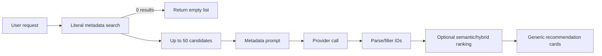

# AI Reading Advisor Evaluation

## Verdict

The reading advisor is **not an end-to-end implemented signature feature**. Its repository contains useful contracts, parsers, provider abstractions, payload tiers, mock tests and UI components, but the production composition and retrieval order are wrong. For a non-empty request, `CandidateBookReader` first performs literal metadata search. When the user's concepts do not appear literally in catalogue fields, it returns no candidates and the pipeline returns an empty result. Semantic/hybrid ranking is attempted only after candidate selection and model output. That is the inverse of a grounded retrieval architecture.

`AiServiceExtensions.AddAiGatewayCore` also does not register a concrete `IAiGateway`, `IAiProvider` or `IAiPreviewGate`, and the advisor/privacy/plan views are not integrated into the main shell. Answer mode explicitly throws `NotImplementedException`. Existing tests prove parsing, ID filtering and structural behavior with mocks, not real relevance or grounding.

## Current pipeline



Problems: retrieval is keyword-gated, intent is not decomposed, negative requirements are not represented, content passages are not assembled, explanations do not cite evidence, and late ranking cannot rescue a book excluded before the model call.

## Required benchmark prompts and current assessment

The table is a static architecture evaluation, not a live-model relevance score. No representative, legally usable benchmark catalogue and no configured provider were available in the repository; live values are therefore `NOT ASSESSED`.

| Category | Prompt | Expected system behavior | Current architecture result | Status |
| --- | --- | --- | --- | --- |
| Topic | “Something explaining the fall of empires.” | Semantic retrieval over subjects, descriptions, TOC and passages | Likely empty unless literal words occur in metadata | FAIL BY DESIGN |
| Mood | “Something thoughtful but not depressing.” | Infer tone, use evidence and admit uncertainty | No tone facets/evidence model | NOT IMPLEMENTED |
| Difficulty | “Teach me economics without assuming I studied economics.” | Apply topic + introductory-level constraints | No difficulty extraction or robust proxy | NOT IMPLEMENTED |
| Length | “Something short I can finish this weekend.” | Use page count/reading-time filters | Page count exists variably; intent filter absent | PARTIAL |
| Comparison | “Something like Guns, Germs and Steel but less deterministic.” | Resolve reference, retrieve conceptual neighbors, apply negative preference | No reference-book resolution/negative constraint model | NOT IMPLEMENTED |
| Combination | “African political history after independence, focused on institutions rather than biographies.” | Hybrid retrieve, filter and rerank multiple positive/negative facets | Literal search cannot reliably retrieve candidates | FAIL BY DESIGN |
| Negative | “Something on AI, but not a programming textbook.” | Topic retrieval plus exclusion penalty | No negative requirement representation | NOT IMPLEMENTED |
| Broad discovery | “Surprise me with something I probably wouldn't normally choose.” | Use history, diversity and novelty with transparent basis | No novelty/diversity policy | NOT IMPLEMENTED |

## Grounding and hallucination review

- Book IDs returned by the model are filtered against candidate IDs. This is a useful guard against recommending wholly absent books.
- That guard does not prove the explanation. The model receives title, authors, year, tags, categories, description and notes, but no source-labeled passages in the normal advisor pipeline.
- Recommendations cannot distinguish “the description states X” from “the title suggests X.” No claim-level evidence structure is persisted or rendered.
- Content-aware Tier 3 is modeled in privacy contracts but is not an operational evidence retrieval path.
- Availability is not a first-class retrieval filter across root health, file status and duplicate assets.
- The parser can reject malformed IDs, but there is no factuality judge, attribution coverage metric or abstention threshold.

## Evaluation design required

Create a versioned fixture catalogue with representative metadata, sparse metadata, extracted TOCs and page passages. For each benchmark query store:

```text
query_id
query_text
required_filters
expected_highly_relevant_book_ids
acceptable_book_ids
irrelevant_book_ids
expected_evidence_sources
known_ambiguities
```

Track retrieval separately from generation:

| Layer | Metrics / tests |
| --- | --- |
| Intent | facet precision, negative-constraint capture, deterministic filter extraction |
| Candidate retrieval | Recall@20/50, unavailable-book rate, duplicate-edition rate |
| Reranking | nDCG@5/10, MRR, diversity and constraint satisfaction |
| Explanation | evidence attribution coverage, unsupported-claim rate, limitation disclosure |
| End-to-end | Precision@3, human relevance score, abstention quality, latency, token/cost budget |
| Privacy | payload tier correctness, preview/consent, no sensitive logging, deletion |

Gates should be set after a human-labeled baseline, not invented now. A release candidate must include both deterministic offline evaluation and a quarantined live-provider suite. Provider model, prompt version, catalogue snapshot, extractor/chunker/embedding versions and evaluation date must be recorded.

## Recommended target pipeline

```mermaid
flowchart LR
    Q[User request] --> Intent[Intent and constraint extraction]
    Intent --> Filters[Availability + structured filters]
    Intent --> Retrieve[Hybrid candidate retrieval]
    Filters --> Retrieve
    Retrieve --> Rerank[Deterministic/semantic reranking]
    Rerank --> Evidence[Source-labeled evidence assembly]
    Evidence --> Explain[Optional provider explanation]
    Explain --> Validate[ID + citation + constraint validation]
    Validate --> Result[Recommendations or honest abstention]
```



Core retrieval must work without an LLM. Provider failure should still yield ranked catalogue results with deterministic evidence snippets. The LLM enhances intent and prose; it does not control catalogue truth.

## Release recommendation

Do not market the current advisor. Preserve the provider-neutral contracts, privacy-tier concepts, parser and audit schema where tests justify them. Rewrite candidate retrieval and runtime composition, then add evidence objects and measurable evaluation before exposing the feature in the shell.

