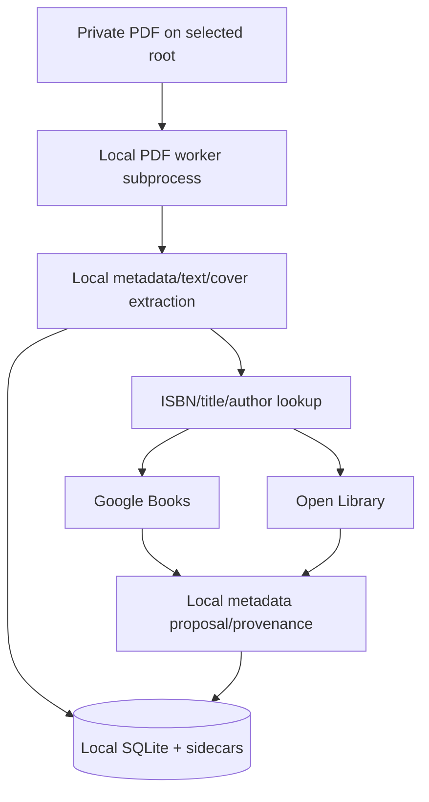
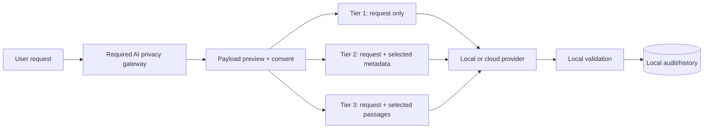

# Privacy and AI Data Flow

## Plain-language answer

In standalone use, catalogue and PDF processing are intended to remain local. Bibliographic enrichment sends identifiers or title/author queries to Google Books and Open Library. Optional local Ollama sends data only to the configured local endpoint. Optional cloud AI can receive the user's request and selected catalogue metadata; the architecture contemplates a higher tier that can send extracted passages, but the current advisor does not implement a complete content-evidence path. AI history stores full user queries and a truncated completion summary locally. No analytics integration was found.

The current product does not yet give the user a complete, reachable, reliable answer to “what will leave my machine?” because the privacy centre, payload preview and provider setup are not fully wired into the application shell.

## Standalone ingestion and enrichment

External metadata providers can infer that a queried title/ISBN is in or near the user's collection. Requests need durable caching, minimisation, explicit provider disclosure, timeouts and a user-controllable enrichment setting. Raw provider responses and retention policy must be documented.

## AI advisor tiers

The current code has tier and audit concepts, but the gateway is not fully bound at runtime. Any code path that bypasses it must be prohibited by architecture tests.

## Data inventory

| Data | Local storage/use | Potential recipient | Current concern |
| --- | --- | --- | --- |
| File paths | SQLite/settings/log context | Should remain local | Path redaction and logs are not centralised |
| PDF bytes | Root and PDF subprocess | Classroom client when published | Worker is isolated by process, not sandboxed |
| ISBN/title/author | Catalogue/provider request | Google Books/Open Library | Automatic enrichment and durable cache policy unclear |
| Extracted text/chunks | SQLite/sidecars/search | Local embeddings; optional cloud content tier | Explicit content-tier flow not complete |
| Embeddings | Local database/index | Ollama or configured embedding provider | Model/version lifecycle incomplete |
| Advisor prompt | Local history/gateway | Local/cloud completion provider | Full query stored locally; provider retention evidence absent |
| Candidate metadata | Prompt payload | Cloud provider at metadata tier | Up to 50 books and descriptions/notes may be included |
| Extracted passages | Intended content tier | Cloud provider only with opt-in | No complete source/citation pipeline yet |
| Personal notes/history | Local DB; potentially metadata prompt | Cloud provider if payload builder includes notes | Notes are especially sensitive and should default excluded |
| Usage/tokens/cost | AI audit tables | Provider also observes use | UI and retention controls incomplete |
| Classroom identity/state | Host and client stores | Classroom host/client | Minors, isolation and erasure require live acceptance |

## Privacy findings

1. **P0 — gateway enforcement is not runtime-complete.** Provider abstractions exist, but missing core registrations mean the promised single controlled exit is not proven.
2. **P1 — user-facing transparency is inaccessible.** Privacy and preview views exist but are not consistently reachable from the shell.
3. **P1 — notes are included in metadata payload construction.** Personal notes should be excluded by default or separately consented.
4. **P1 — provider governance is documentation-heavy.** Region, retention, no-training and deletion claims need provider-specific evidence and dates.
5. **P1 — AI history needs a clear retention choice.** Full queries can disclose reading interests; deletion/export must be visible and tested.
6. **P1 — classroom/minors controls lack operational proof.** Code and tables do not substitute for adversarial isolation, policy and DPIA acceptance.
7. **P2 — logs are too fragmented to guarantee redaction.** Central structured logging with data classification is required.

## Required privacy contract

- Core catalogue, reader, covers, collections, structured search and full-text search work with all external providers disabled.
- Every outbound adapter declares its data classes, purpose, endpoint, retention evidence, region, timeout and cache key.
- The AI gateway is the only permitted completion/embedding egress and is enforced by architecture tests.
- Payload previews show exact fields and passage excerpts; personal notes are off by default.
- Consent is provider-, tier- and purpose-specific; remembered consent is visible and revocable.
- AI artifacts store source hash, prompt/template version, model, generation date and retention state.
- Logs never contain full PDF text, secrets or private prompts by default.
- Export/delete operations remove history, cached payloads, vectors and provider credentials with verified evidence.

