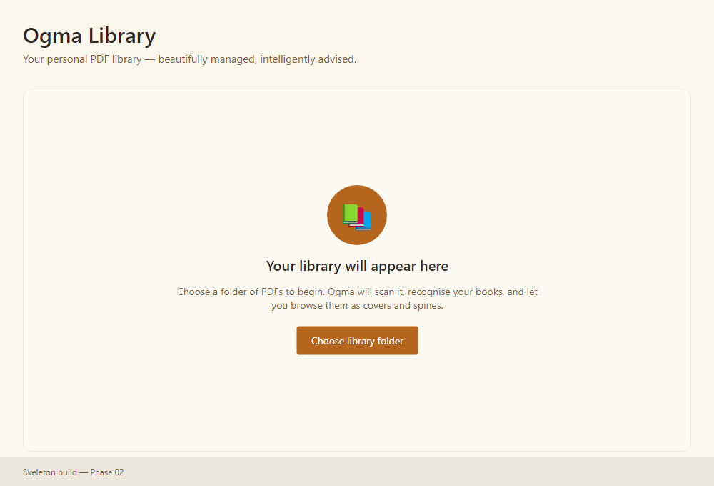

# Ogma Library — Developer Guide

A local-first, cross-platform (Windows + macOS) PDF library application built on
.NET 10 LTS and Avalonia. This guide covers building, running, testing, and
contributing. For the full plan see `docs/plans/grand-plan/`; for decisions see
`docs/adrs/` and `docs/plans/grand-plan/DECISIONS.md`.

## Prerequisites

- **.NET 10 SDK 10.0.401 or a later 10.0 feature band**, pinned by `global.json` (`dotnet --version` in the repo must print 10.0.4xx or later). CI installs the same SDK from `global.json`.
- **Git** 2.40+.
- Windows: the **WebView2** Evergreen runtime (for the 3D shelf, Phase 14+).
- macOS: WKWebView ships with the OS.
- Optional: **Ollama** (local AI), **Tesseract** (OCR) — later phases.

Native assets (SkiaSharp, PDFium via PDFtoImage, SQLite) restore as NuGet
packages; `nuget.config` clears machine sources for a deterministic restore.

## Build & run

```bash
dotnet restore OgmaLibrary.sln
dotnet build   OgmaLibrary.sln -c Release      # warnings are errors
dotnet run     --project src/OgmaLibrary.App   # launches the skeleton window
```

The current skeleton renders a localized main window (English/French):



### Settings and environment overrides

Users turn optional features on in **Settings** (Sept-23 Phase 08); the choice is stored in
`user-preferences.json` in the data folder and applies without a restart. The environment
variables below are **administrator and test overrides**, not the way to enable features. When
one is set it wins over the user's choice, and Settings shows the switch disabled with the
variable's name.

| Variable | Overrides | Values |
|---|---|---|
| `OGMA_ENABLE_METADATA_PROVIDERS` | Settings → Online services → Look up book details online | `true`/`1` or `false`/`0` |
| `OGMA_ENABLE_3D_SHELF` | Settings → Optional features → 3D bookshelf (preview) | `true`/`1` or `false`/`0` |
| `OGMA_ENABLE_CLASSROOM_HOST` | Settings → Optional features → Classroom Host | `true`/`1` or `false`/`0` |
| `OGMA_LIBRARY_DATA_DIR` | The data folder (tests and E2E always set it) | absolute path |
| `OGMA_LIBRARY_ROOT` | Adds and scans one library folder at start-up | absolute path |

## Test

```bash
dotnet test OgmaLibrary.sln -c Release -m:1
```

Three test projects:

- `OgmaLibrary.Tests` — domain unit tests + the golden-corpus harness
  (`SyntheticCorpusGenerator`, `ManifestVerifier`).
- `OgmaLibrary.Tests.Architecture` — NetArchTest rules enforcing the
  bounded-context dependency direction (HLD §2.2).
- `OgmaLibrary.Tests.Ui` — headless Skia rendering; produces skeleton
  screenshots under `artifacts/screenshots/` and verifies the en↔fr culture
  switch.

- `OgmaLibrary.Tests.E2E` — real-window golden journeys that drive the built
  app through Windows UI Automation (`Category=E2E`, excluded from the fast
  suite). See [e2e-harness.md](e2e-harness.md).

Search indexing details are in [search-index.md](search-index.md), including
the Phase 10 FTS5 external-content table and trigger maintenance rules.

## Solution structure

```
src/
  OgmaLibrary.Domain          entities, value objects, repository interfaces (no outward deps)
  OgmaLibrary.Application      use-case interfaces, DTOs (depends on Domain only)
  OgmaLibrary.Infrastructure   SQLite/FS/PDF/HTTP/AI adapters (depends on Domain+Application)
  OgmaLibrary.Reader          PDFium reader context
  OgmaLibrary.Bookshelf3D     WebView/Three.js 3D shelf context
  OgmaLibrary.Workers         background jobs
  OgmaLibrary.App             Avalonia shell + the single composition root
tests/
  OgmaLibrary.Tests, .Tests.Architecture, .Tests.Ui, .Tests.E2E
spikes/                       throwaway Phase 01 proofs (excluded from the product)
docs/                         adrs, governance, developer-guide, plans/grand-plan
```

Dependencies point **inward**; only `App` binds implementations to interfaces.
The architecture tests fail the build if this is violated.

## Coding standards (summary)

- .NET 10, `Nullable` enabled, warnings-as-errors, XML docs on public library
  members. Run `dotnet format` before committing.
- Async I/O everywhere with a trailing `CancellationToken`; `ConfigureAwait(false)`
  in library code.
- Per-file scan isolation: one bad PDF never aborts a batch.
- No secrets in the repo; provider keys live in the OS credential store.
- No hard-coded user-facing strings — resolve through `ILocalizationService`
  (en/fr at MVP; es/it/de at final).
- Full rules: `docs/references` Development Standards; Avalonia rules:
  `docs/plans/grand-plan/_reference/AVALONIA-STANDARDS.md` and the
  `avalonia-desktop-development` skill.

## Contributing

See `CONTRIBUTING.md`. Branch from `develop` as `feature/<id>-<slug>`, use
Conventional Commits, sign off every commit (`git commit -s`, DCO), and ensure
`dotnet format` / `dotnet build` / `dotnet test` are green on **both** Windows
and macOS before opening a PR.
