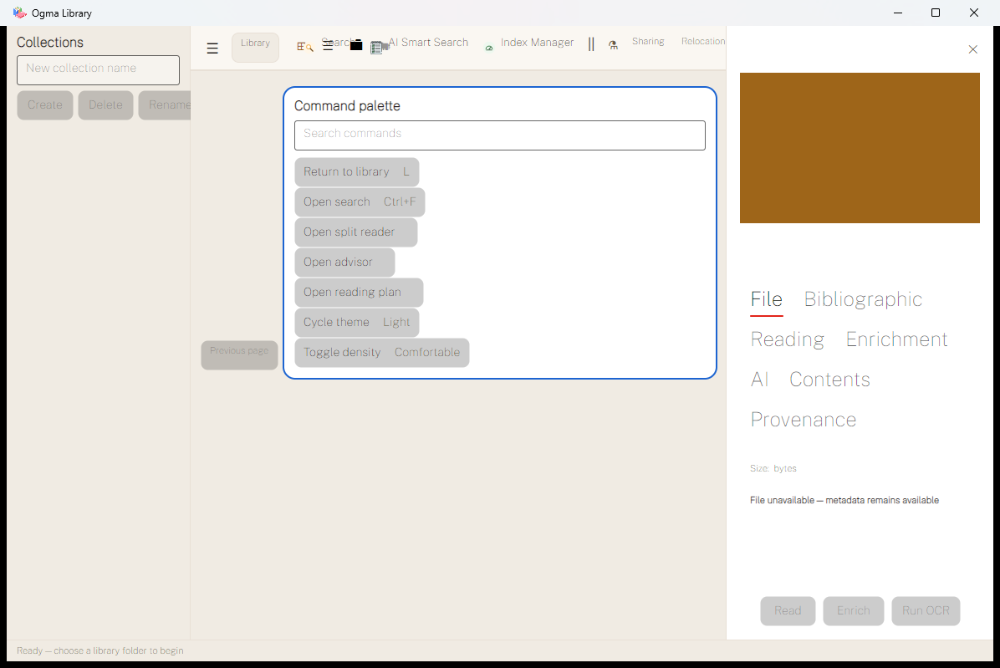
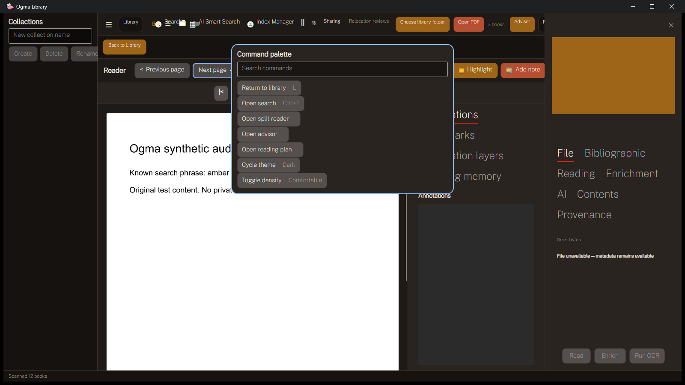

# UI and UX audit: the library must give the page back to the reader

Date: 2026-09-14. Findings refer to commit `a93900a2bd7313a2948a29d2813ec3e14696f877`.
This is diagnosis and a redesign brief. No AXAML, view model, theme, asset or application behavior was changed.

## Observed experience

The interface exposes internal feature categories before establishing the user's task. On first launch, collections CRUD, indexing, relocation, classroom search, sharing and AI compete with adding or opening a book. A permanently visible command palette obscures the center. An empty inspector consumes the right edge. Opening a PDF adds more rows and another side panel, without removing this obstruction.

This is why a token system alone has not produced a good UI. The information hierarchy, visibility states and allocation of space are wrong at the composed-window level. The most urgent repair is functional, followed by a deliberate redesign of the shell and inspector.

## Native evidence and reproduction

The initial September 10 binary was inspected, then the September 14 rebuilt Release application was launched with isolated data. Rebuilt app DLL timestamp observed: 2026-09-14 10:00:10 local time. Test machine: Windows build 26200, .NET SDK 10.0.101. App processes used were 30628 (initial binary) and 3508 (fresh build); both were closed gracefully.

Temporary data root: `C:/Users/Peter/AppData/Local/Temp/ogma-astra-audit-efd341942a94473c8846d1328b02c9c0`. Metadata providers, classroom host and 3D environment flags were explicitly false. Window capture used Win32 PrintWindow for the app window only; UI Automation recorded names, control types, enabled state and bounds. UI Automation's `Offscreen=false` did not reliably indicate actual unobscured visibility, so screenshots were reviewed directly.

| Evidence | State / action | Result |
|---|---|---|
| [fresh-default.png](evidence/fresh-default.png) | Empty data, default 1180x760 client-size declaration | Palette and empty inspector already visible; toolbar and collection actions overlap |
| [fresh-after-escape.png](evidence/fresh-after-escape.png) | Focus Search commands, send Escape | Palette remains; same visible automation controls |
| [fresh-after-command.png](evidence/fresh-after-command.png) | Invoke Return to library | Command executes, palette remains |
| [fresh-after-detail-close.png](evidence/fresh-after-detail-close.png) | Invoke inspector Close | Empty inspector remains |
| [fresh-advisor.png](evidence/fresh-advisor.png) | Invoke Open advisor; resize outer window to 1600x900 | Advisor route opens behind palette; toolbar still overlaps; inspector still shown |
| [fresh-dark.png](evidence/fresh-dark.png) | Invoke Cycle theme | Theme visibly changes, palette stays; proves palette commands can operate despite failed dismissal |
| [fresh-minimum.png](evidence/fresh-minimum.png) | Outer window 876x599, near declared minimum | Study area heavily occluded, tabs/actions clipped, no usable overview |
| [synthetic-reader-page1.png](evidence/synthetic-reader-page1.png) | Open original three-page synthetic PDF | Native PDF content renders; UIA reports Page 1 of 3 |
| [synthetic-reader-page2.png](evidence/synthetic-reader-page2.png) | Invoke Next page | Page 2 of 3; PDF content renders under the palette |
| [fresh-fit-page.png](evidence/fresh-fit-page.png) | Fit page on tiny repository OCR fixture | Page extent changes; fixture is unsuitable as native OCR correctness evidence |
| [native-search-in-reader.png](evidence/native-search-in-reader.png) | Invoke shell Search while reading | Global library search panel opens above reader, not a document-find interface |

The screenshot filenames have matching `-uia.json` records. Reproduction tools are [Inspect-NativeWindow.ps1](evidence/Inspect-NativeWindow.ps1) and [New-AuditPdf.ps1](evidence/New-AuditPdf.ps1). Synthetic PDF SHA-256: `046C7EF76B58F2CEB35A830802B2206B78C2D4573065739FB3105053BBC491D7`.

A first file-picker automation attempt did not set the file-name field and opened the existing selection instead. That observation is excluded from fixture acceptance; its book-cover capture and automation record were moved out of this report directory into the temporary audit folder. No source PDF was edited. Subsequent controlled tests used the tiny repository fixture and the original synthetic PDF. The retained reader screenshots show only fixture content. This limitation is recorded so the native sample is not overstated.

### The actual first-run screen



### The reading screen



## Command palette: F01, owner's explicit complaint

Peter reports that the palette is distracting, has no apparent purpose and is impossible to close. Native reproduction confirms failure to dismiss through Escape and command completion. There is no visible close control in the palette markup. This is P0 because it blocks the core reading surface repeatedly, not because palettes are intrinsically bad.

The likely binding defect is precise:

```text
Window DataContext: StartupShellViewModel
  palette Border DataContext: MainShell
  palette IsVisible binding: MainShell.IsCommandPaletteOpen
                             ^ looks for another MainShell on MainShellViewModel
```

`DesktopShellWindow.axaml` sets both properties on the same Border and disables compiled bindings. `CloseCommandPalette()` correctly sets the shell boolean false, but the visual is not observing that boolean at the expected path. Source inspection plus reproducible native behavior strongly supports this diagnosis; a controlled binding-log regression test remains the final root-cause proof for implementation.

Escape handling exists in both the window and palette input. Adding another Escape handler alone would not repair the visibility path. A future fix should use one explicit binding source, then test the actual Border and focus owner.

**Proposed product disposition:** make command search an optional power-user convenience, closed by default and absent from onboarding. Put every ordinary action in discoverable menus/buttons. Provide a visible Close button, Escape, outside-click dismissal for this nondestructive overlay, focus restoration and command completion dismissal. No tutorial or forced preference should be required to hide it. Consider removing the feature from the initial release if it cannot demonstrate value in usability sessions; retain FR-UX-003 through a formal scope decision rather than quietly deleting a requirement.

## Right inspector: F02/F14, owner's explicit overhaul request

The current inspector is 320 device-independent pixels wide. A 180px cover and subsequent spacing precede seven headings: File, Bibliographic, Reading, Enrichment, AI, Contents and Provenance. Native captures show those headings wrapping into several rows, much larger than the body text, with a red selected-tab underline from the default control theme. Empty File content and an unavailable-file warning appear even when no book is selected. Read, Enrich and Run OCR occupy the footer without enough contextual explanation.

The shell also has the same scoping pattern as the palette: `DataContext="{Binding BookDetail}"` with `IsVisible="{Binding BookDetail.IsVisible}"`. The child itself binds `IsVisible` correctly, but the parent usage introduces another local binding. Repair the ownership, then validate open/close/selection transitions.

### Target information hierarchy

This is a planning wireframe, not an implemented design:

```text
Book title, readable on two or three lines                 Close
Author / year / edition                       [small cover]
Reading state and last position
[Read / Resume]                [More actions]

Overview | Notes | Details

Overview: description, tags, collection membership
Notes: bookmarks, highlights and recent reading memory
Details: metadata, file availability, source/provenance
         Contents and enrichment review as labeled sections

Inline feedback / pending changes / recovery action
```

Keep advanced information available. The point is to reveal it where needed, not discard provenance or file controls. A librarian can open an expanded editor for full bibliographic corrections and writeback review; a student should not have to interpret extraction fields to begin reading.

Design rules for phase 07:

- No selection means no inspector. Closing returns space and keyboard focus to the selected book.
- A selected missing file retains real metadata, explains availability and offers relink; it is different from no selection or loading.
- Read/Resume is the primary action. Metadata enrichment and OCR are secondary, with capability and network/privacy consequences stated before action.
- Prefer a resizable dock at larger widths and an explicitly dismissible overlay or dedicated detail route when space is insufficient. The minimum reader width wins over a permanently docked panel.
- Summary and Close remain visible while the content scrolls. Do not use seven wrapping tabs or giant empty cover blocks.
- Edited/unsaved, conflict, locked PDF, enrichment pending/rejected, writeback preview, permission failure and rollback states all have defined behavior.
- Book title/author/cover come from the same selected identity. Rapid selection must cancel stale loads and prevent a prior book's details from appearing under the current title.

## Shell and navigation

The current toolbar has fourteen grid columns with many Auto widths and a star slot for view buttons. When fixed-width content consumes the available space, view buttons and Search occupy the same area. The default automation snapshot records overlapping bounds directly. At 1600px the right panel still hides later actions. This is not resolved by changing colors or increasing the default window size.

Proposed structure: a stable library sidebar; a compact page header; one always-discoverable library search; a view switch and sort/filter group; a primary Add/Open action; a contextual book inspector. Settings, processing, privacy, classroom administration and help belong in named destinations or menus. Reading changes the chrome to a reading workspace. Search results preserve query, collection, sort and scroll position on return.

Avoid icon-only ambiguity. Three horizontal lines currently mean both sidebar and list, emoji/glyphs coexist with SVGs, and the grid icon always carries the accent rather than a demonstrated selected-state binding. Use the licensed icon catalogue consistently and show selected state through more than color.

## Reading and study

The native PDF path works on the synthetic three-page fixture. The failure is how little unobstructed, controlled space the PDF receives. The library sidebar, shell toolbar, Back to Library row, navigation/actions row, duplicate page/zoom row, study tabs and catalogue inspector can coexist. Near the minimum window size this leaves almost no practical page viewport.

Reader phase 08 should establish one toolbar for page/zoom/layout/find, a predictable full-screen mode, optional thumbnails/TOC, and a single collapsible study rail. Phase 09 should make selection -> highlight/note/citation -> persistence -> export a complete interaction. Put JSON state import/export under a document menu; do not make them compete with page navigation on every reading session.

`ReaderView_KeyDown` handles page navigation and Ctrl-based bookmark/citation commands. In-book find, mode controls and full-screen are not in that view's current markup. Existing reader services must be connected to these user-facing requirements, with contextual shortcuts that cannot accidentally move a page while editing a note.

## Typography, themes and visual authorship

Proposed direction: a calm scholarly library whose visual emphasis belongs to covers, titles and the PDF page. Retain Public Sans for interface labels, Spectral for restrained library/editorial headings, and JetBrains Mono for technical identifiers only, pending actual font-weight and license verification. These roles already exist in Tokens.axaml and suit the product's distinction between controls, bibliographic content and technical detail. Do not use display typography for every inspector tab.

The palette should use existing warm surfaces cautiously, with a clearer neutral structure and fewer simultaneous accent actions. Oak identifies the primary library action, ink supports reading, clay denotes attention or risk only where that meaning is real. No token-color change is approved by this report; compare proposed alternatives on the same real content before adoption.

The light captures show very thin/faint text. PublicSans-VF.ttf makes a font-weight-loading investigation worthwhile, but the audit did not prove a variable-font defect. Test resolved face and weight, glyph coverage, selected/disabled text and OS scaling. A numerical palette contrast test cannot certify antialiased text legibility or the composed control's effective foreground.

## Surface rubric and limits

The design engine uses weighted 0-4 dimensions and separate hard gates. A complete Windows/macOS surface score would imply coverage this audit does not have, so the matrix reports diagnostic ratings for the observed Windows slice and leaves material missing evidence explicit. The 40/100 product readiness index is defined separately in the product audit.

| Design dimension | Observed Windows rating /4 | Basis |
|---|---:|---|
| Distinctiveness / purpose-fit | 1 | Named theme exists, but feature cramming and default components dominate the task |
| Visual hierarchy | 1 | Too many competing tools, permanent overlays, advanced metadata before reading |
| Accessibility | NOT ASSESSED in full | Obscured content and dismissal failures confirmed; native screen-reader audit absent |
| Typography | 1 | Thin/faint labels, oversized inspector tabs, no real weight-resolution proof |
| Color and contrast | 2, partial | Tokens and automated contrast checks exist; rendered-state contrast not comprehensively measured |
| Layout and adaptation | 0 | Overlap and clipping reproduced at default, large and near-minimum windows |
| Interaction states | 1 | State booleans do not reliably govern visible overlays; missing no-selection distinction |
| Motion | NOT ASSESSED | Native 3D/reduced-motion behavior not exercised |
| Content and microcopy | 1 | AI-ready wording, technical destinations, scan-count mismatch, weak first-use explanation |
| Performance | NOT ASSESSED on reference hardware | Native small-fixture activity is not a cold-start, scroll or large-library benchmark |
| IA/navigation (supplemental) | 1 | Competing search destinations and unmounted settings/operations |
| Trust (supplemental) | 1 | User cannot dismiss panels; capability/status labels are not consistently truthful |

macOS: NOT ASSESSED. WCAG 2.2 is used as the repository's acceptance target; native Narrator/VoiceOver and platform semantics must supplement it. This report does not claim legal accessibility certification. Web CWV and 320px web reflow are not applied indiscriminately to a native desktop window.

## Required UX validation

Use the same task scripts before and after redesign: add a folder, find a named book, inspect it, dismiss inspector, open and resume, find a phrase in the PDF, make a note, export it, find related books without AI, understand AI disclosure, and reconnect to a school library. Include keyboard-only and low-vision users, a librarian and a school administrator.

Phase 19 uses formative sessions first and a larger acceptance sample after fixes. Record task completion, errors, assistance, time and exact blocked state. Do not present participant preference as functional acceptance or report a statistically generalizable 95% success rate from a tiny convenience sample. The plan defines the target and denominator explicitly.
