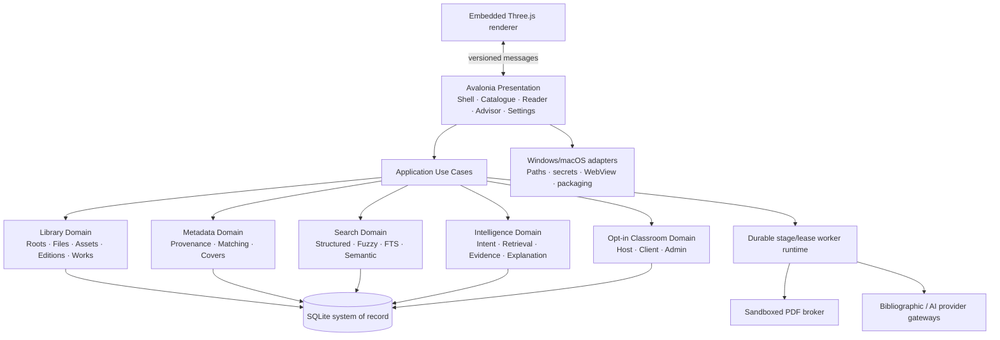
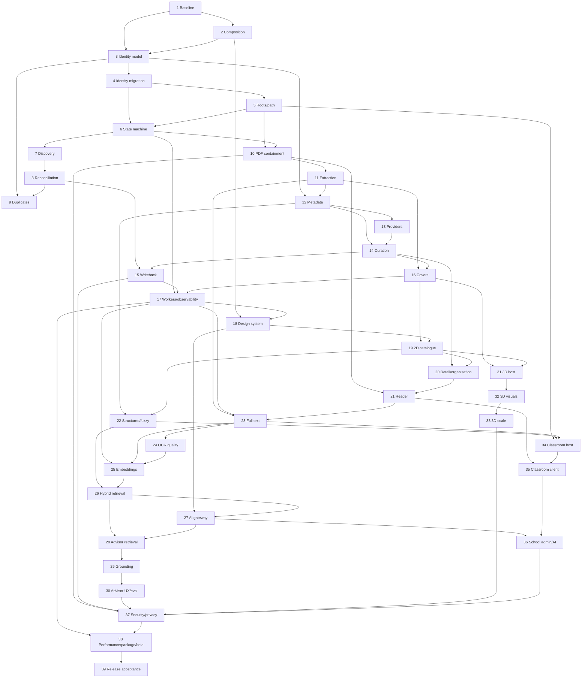

# Ogma Library 39-Phase Roadmap Overview

## Executive Summary

This is the authoritative completion plan for **one C#/.NET Avalonia desktop application on Windows and macOS**. It contains **exactly 39 phases**. It contains no mobile application, mobile client, PWA, or mobile-readiness phase. The embedded TypeScript/Three.js shelf is an internal rendering asset consumed by the C# desktop host, not an independent product.

Ogma is buildable and well tested at source level, but only 40–48% complete under end-to-end product evidence. The plan deliberately halts feature expansion while file identity, root reconciliation, processing and metadata safety are repaired. AI and 3D follow reliable 2D catalogue/search foundations. Opt-in classroom modes remain in the same desktop codebase because the latest SRS includes them. Release requires signed Windows artifacts, signed/notarized macOS artifacts and physical acceptance on both platforms.

## Current State

- .NET 10 Release build is warning-free; 800 automated tests pass.
- Project dependency direction, reader foundations, FTS5, EF migrations and provider abstractions are valuable.
- File identity is mislocated at book level, missing-drive logic is unsafe, and automatic metadata writeback violates consent.
- Advisor candidate retrieval is keyword-gated and core services are not fully composed.
- 3D navigation/host adapters are incomplete and the renderer displays untextured boxes.
- CI builds/tests Windows and macOS, but no installer/signing/notarization/update/rollback pipeline exists.

## Actual Estimated Completion

Planning point: **44%**; defensible range: **40–48%**. See `docs/audit/07-implementation-completeness.md`.

## Most Serious Findings

1. P0 physical-file/edition/work model and reconciliation defects.
2. P0 automatic modification of original PDFs without confirmation.
3. P0 PDF process isolation is not an OS sandbox.
4. P0 advisor retrieval cannot reliably discover conceptual matches.
5. P0 3D host integration and trusted release distribution are absent.

## Target Architecture

Ogma converges on a local-first modular monolith with explicit bounded contexts and platform adapters. SQLite remains the system of record; sidecars are versioned derived assets. Workers share the process initially but use durable leases and stage contracts so they can be isolated later without changing domain APIs. The core library never depends on an LLM or network service.

## Major Product Domains

Library integrity; bibliographic identity; PDF and content processing; metadata/provenance/covers; 2D catalogue and reader; structured/full-text/fuzzy/semantic search; AI advisor; 3D shelf; opt-in classroom; security/privacy; reliability/observability; Windows/macOS distribution.

## 39-Phase Overview

| Phase | Name | Primary Domain | Major Deliverable | Dependencies | Risk |
| ---: | --- | --- | --- | --- | --- |
| 1 | Evidence Baseline and Scope Freeze | Governance | Signed desktop-only baseline and executable gates | None | High |
| 2 | Composition, Configuration and Startup | Architecture | Modular registrars, options validation, async startup | 1 | High |
| 3 | Canonical Library Identity Model | Domain | Root/file/asset/edition/work semantics | 1–2 | Critical |
| 4 | Identity Schema and Data Migration | Database | Reversible migrated catalogue | 3 | Critical |
| 5 | Library Roots and Path Security | Integrity | Multi-root platform-safe access | 3–4 | Critical |
| 6 | Processing State Machine and Scan Sessions | Jobs | Durable staged lifecycle | 4–5 | Critical |
| 7 | Discovery and Incremental Scanning | Ingestion | Idempotent recursive scanner | 5–6 | High |
| 8 | Filesystem Reconciliation and Recovery | Integrity | Safe move/change/missing logic | 7 | Critical |
| 9 | Duplicate and Bibliographic Resolution | Identity | Exact/edition/work review workflows | 3–8 | Critical |
| 10 | PDF Validation and Containment | Security/PDF | Brokered platform sandbox | 5–6 | Critical |
| 11 | PDF Extraction and ISBN Primitives | PDF | Versioned resilient extraction | 10 | High |
| 12 | Canonical Metadata and Provenance | Metadata | Field contracts and confidence | 3–4, 11 | Critical |
| 13 | Bibliographic Provider Gateway | Metadata | Cached resilient enrichment | 12 | High |
| 14 | Metadata Review and Manual Curation | Metadata/UX | Possible-match/editor workflow | 12–13 | High |
| 15 | Safe Writeback and Override Protection | Integrity | Confirmed reversible writeback | 8, 12–14 | Critical |
| 16 | Cover, Thumbnail and Spine Assets | Assets | Versioned visual asset pipeline | 6, 11–14 | High |
| 17 | Worker Reliability and Observability | Platform | Leases, recovery, structured telemetry | 6–16 | High |
| 18 | Ogma Design System and Application Shell | UX | Tokenised accessible shell/settings | 2, 17 | High |
| 19 | Production 2D Catalogue | Catalogue | Grid/list/directory/filter/sort | 16, 18 | High |
| 20 | Book Detail, Organisation and Reading State | Catalogue | Curation and status workflows | 14, 18–19 | Medium |
| 21 | Reader Completion and Portability | Reader | Split view, export, durable annotations | 10–11, 18, 20 | High |
| 22 | Structured and Fuzzy Catalogue Search | Search | Fast typo-tolerant lookup | 12, 19 | High |
| 23 | Full-Text Pipeline and Search | Search | Page-aware extraction/index/navigation | 11, 17, 21 | High |
| 24 | Selective OCR and Extraction Quality | OCR | Policy-driven OCR and quality review | 10–11, 23 | High |
| 25 | Versioned Embeddings and Vector Lifecycle | RAG | Deterministic stale-safe index | 17, 23–24 | Critical |
| 26 | Semantic and Hybrid Retrieval | Search | Calibrated scalable retrieval | 22–25 | Critical |
| 27 | AI Gateway, Privacy and Cost Runtime | AI/Privacy | Reachable provider-neutral safe gateway | 17–18, 26 | Critical |
| 28 | Advisor Intent, Candidates and Reranking | Advisor | Correct retrieval-first pipeline | 26–27 | Critical |
| 29 | Grounded Explanations and Answer Mode | RAG | Evidence-backed recommendations/answers | 28 | Critical |
| 30 | Advisor UX and Quality Evaluation | AI/UX | Measured accessible signature experience | 27–29 | High |
| 31 | Native 3D Host and Catalogue Contract | 3D | WebView2/WKWebView runtime | 16, 18–19 | Critical |
| 32 | Virtual Bookshelf Visuals and Interaction | 3D | Real shelf, textures, controls | 31 | High |
| 33 | 3D Scale, Accessibility and Performance | 3D | Virtualised benchmarked experience | 19, 32 | Critical |
| 34 | Classroom Host Security and Read Model | Classroom | Opt-in secured LAN host | 5, 17, 22–23, 37* | Critical |
| 35 | Classroom Client, Offline and Sync | Classroom | Paired desktop client mode | 21, 34 | High |
| 36 | School Administration and Managed AI | Classroom | Roles, quotas, minors and AI controls | 27, 34–35 | Critical |
| 37 | Security, Privacy and Data Protection Hardening | Assurance | Cross-cutting hostile validation | 10, 15, 27, 34–36 | Critical |
| 38 | Performance, Reliability, Packaging and Beta | Release | Signed release candidates and operations | 17–37 | Critical |
| 39 | Cross-Platform Release Acceptance and Handover | Release | Production-ready Windows/macOS release | 38 | Critical |

`37*`: Phase 34 may develop behind disabled flags before Phase 37, but public enablement cannot occur until Phase 37 passes.

## Architectural Freeze Points

| Freeze | Phase | Meaning |
| --- | ---: | --- |
| Scope/evidence | 1 | Exactly one Windows/macOS desktop product; requirement baseline and conflicts approved |
| Domain model | 4 | Root/file/asset/edition/work identities and migration contract frozen |
| Integrity pipeline | 9 | Scanner, reconciliation and duplicate semantics frozen |
| Metadata contract | 15 | Canonical fields, provenance, confidence, overrides and writeback frozen |
| Search contract | 26 | Structured/FTS/semantic interfaces and score fusion frozen |
| AI retrieval | 30 | Intent, evidence, explanation and evaluation contracts frozen |
| 3D client contract | 33 | C#/WebView message and asset contracts frozen |
| Release schema | 38 | No unplanned schema change after signed release candidate |

---

> Canonical phase files and navigation: [README.md](README.md). Each phase is independently executable and contains the complete objective, architecture, implementation, testing, migration, Definition of Done and Kaizen sections.

## Phase Dependency Graph

Critical path: 1→3→4→5/6→7→8→9 and 10→11→12→14→15→17→18/19→22/23→25→26→27→28→29→30→37→38→39. The 3D and classroom branches can proceed after their upstream contracts freeze, but Phase 37 must close them before packaging. Phases that should not overlap incompatibly: 3–4 with identity-dependent feature changes; 12–15 with uncontrolled metadata writes; 25–26 with advisor retrieval; 31–33 with an unstable catalogue/asset contract; schema changes after the Phase 38 freeze.
