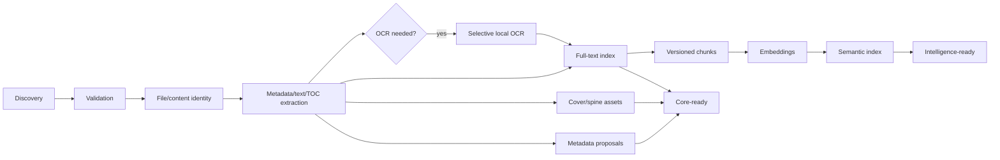

# PDF Processing Roadmap

> Part of the canonical [August 39-phase desktop roadmap](../README.md).

## Target evolution

Core-ready never waits for embeddings, AI or external metadata. Each stage has queued, processing, succeeded, retryable-failed, terminal-failed and cancelled outcomes plus typed exceptional states such as password-required, unsupported, corrupt, review-required and root-unavailable.

| Phase | Pipeline capability | Idempotency/version key | Failure/retry behavior |
| ---: | --- | --- | --- |
| 5–8 | Root-safe discovery/reconciliation | root + observation session + canonical relative path | Failed/incomplete root scan performs no absence transition |
| 6, 17 | Durable stages and leases | stage type/version + target + input hash | Lease expiry, exponential backoff, dead letter, retry/cancel |
| 10 | Validation and containment | content candidate + validator/sandbox version | Hostile/timeout/resource/password isolated per file |
| 11 | Metadata/text/TOC/render extraction | asset hash + extractor/config version | Partial page errors retained; reprocess by version |
| 12–15 | Metadata proposal/review/writeback | field/source/matcher version; writeback source hash | Ambiguity waits for review; writeback requires confirm/backup |
| 16 | Cover/spine variants | asset/source + generator + size/format | Source fallback; corrupt variant regenerated |
| 23 | FTS | asset + selected text/extractor + FTS schema version | Side-by-side resumable rebuild |
| 24 | OCR | page render hash + OCR model/language/config | Only qualifying pages; failure does not block reader |
| 25 | Chunks/embeddings | source + extractor + chunker + model/provider/dimension | Resume per chunk; old compatible index remains until swap |
| 26 | Semantic index | vector compatibility + index/fusion version | Fallback to structured/FTS |
| 38–39 | Packaged acceptance | release artifact + platform + dependency hashes | Clean-install corpus, crash/rollback and resource proof |

## Invalidation rules

| Change | Required invalidation |
| --- | --- |
| Path/rename only | File locator/presence; no content/metadata/vector regeneration |
| Exact additional copy | New file occurrence only; reuse content-derived artifacts |
| File bytes changed | New content asset; validation through all derived stages |
| User metadata change | Structured/fuzzy index, display/spine; content vectors only if metadata document is embedded |
| Extraction/parser change | Text/TOC/FTS/chunks/embeddings/evidence; covers only if render source changed |
| Chunker change | Chunks/embeddings/vector index/evidence caches |
| Embedding model/dimension change | Embeddings/vector index/semantic caches |
| File deleted but another copy exists | File availability only; edition remains actionable through other asset |
| Root unavailable | No destructive invalidation; action availability becomes degraded |

## Resource and security policy

- All parse/render/OCR operations use the Phase 10 broker and platform sandbox.
- The broker grants access to one approved input and a bounded output channel.
- Passwords use one-shot IPC and are zeroised; they never appear in environment variables or logs.
- Per-stage CPU, memory, wall-clock, page/output limits and concurrency groups are explicit.
- OCR is local and selective; ordinary text PDFs are not OCRed.
- A malformed or malicious file cannot stop the scan batch.

## Operational evidence

The acceptance corpus includes valid, malformed, encrypted, image-only, mixed, unusual Unicode/fonts, huge-page and huge-byte PDFs, plus rename/move/replace/copy/root-disconnect scenarios. Results record source provenance, expected outcomes, parser/sandbox versions, timing and resource use. Legal fixture provenance is mandatory.

