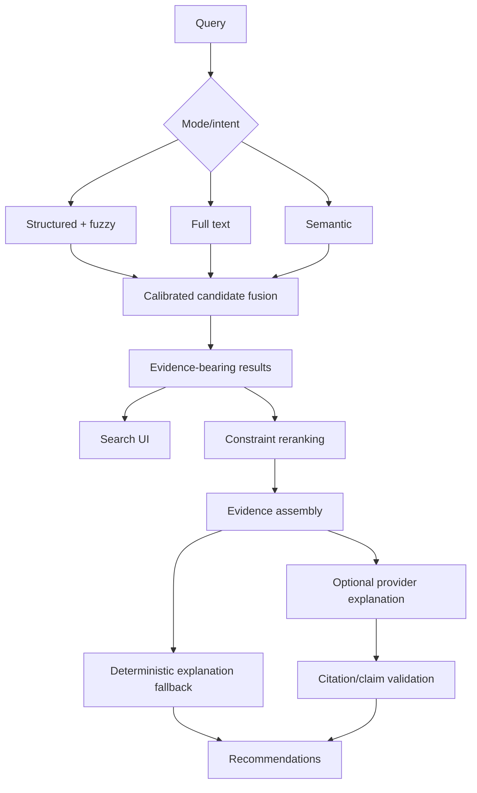

# Search and AI Roadmap

> Part of the canonical [August 39-phase desktop roadmap](../README.md).

## Separate systems

| System | User intent | Data | Available after | AI required? |
| --- | --- | --- | ---: | --- |
| Structured catalogue search | Known title/author/ISBN/tag/filter | Canonical metadata | 22 | No |
| Fuzzy catalogue search | Misspelling/variant | Normalized metadata terms | 22 | No |
| Full-text search | Known words/phrases inside books | Page-aware extracted text/FTS5 | 23–24 | No |
| Semantic search | Concepts/themes | Versioned metadata/content embeddings | 25–26 | Embedding model; local supported |
| Advisor retrieval | Reading intent/constraints | Structured + FTS + semantic candidates | 28 | No completion model required |
| Explanation/answer generation | Natural explanation/cited answer | Source-labeled candidate evidence | 29 | Optional completion model |

## Phase sequence and quality gates

| Phase | Deliverable | Quality gate |
| ---: | --- | --- |
| 22 | exact/prefix/fuzzy field search | “tolkein” fixture; p95 ≤150 ms at 50k |
| 23 | page-aware FTS | correct snippet/page jump; p95 ≤500 ms; crash-safe rebuild |
| 24 | selective OCR | accuracy/resource threshold on image/mixed corpus |
| 25 | versioned chunks/vectors | complete compatibility tuple; no stale delete/change/model cases |
| 26 | semantic/hybrid retrieval | Recall@K, MRR/nDCG, bounded memory/latency, lexical fallback |
| 27 | enforced gateway/privacy/cost | no provider bypass; consent/preview/secret/delete proof |
| 28 | intent/candidate/rerank | all eight prompt categories; availability/negative/diversity constraints |
| 29 | grounded explanation/answers | citation coverage and unsupported-claim thresholds; prompt-injection suite |
| 30 | advisor UX/evaluation | offline benchmark plus quarantined live-provider gate; accessibility/latency/cost |

## Version and cache keys

- Catalogue search: normalization/index schema + metadata version.
- FTS: content asset + extractor + selected-text/OCR + FTS schema.
- Chunk: text source + extractor + chunker policy/version.
- Embedding: chunk hash + provider/model/dimension/version.
- Semantic result: query embedding version + index version + filters + fusion version.
- Advisor candidates: normalized request/intent version + catalogue snapshot + retrieval/reranker versions.
- Generated explanation: request + ranked candidates + evidence hashes + provider/model + prompt/template version + tier.

## Evaluation corpus

Store query, required filters, highly relevant, acceptable and irrelevant book IDs, evidence expectations and judgment provenance. Report Recall@20/50 before generation, nDCG@5/10 and MRR for ranking, Precision@3/diversity/constraint satisfaction for recommendations, attribution coverage/unsupported-claim rate for explanations, and latency/token/cost. Never combine retrieval and prose quality into one opaque score.

## Degraded mode

Structured/fuzzy and FTS stay local. Missing vectors disable only semantic results. Missing completion provider still permits deterministic ranked recommendations with metadata/passages and transparent reasons. AI outage never blocks browse, metadata, covers, collections, opening or reading.

