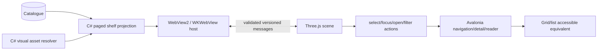

# 3D Bookshelf Roadmap

> Part of the canonical [August 39-phase desktop roadmap](../README.md).

## Architectural rule

The 3D shelf is an embedded renderer and **client of the same catalogue application contract** as grid/list/directory. It owns no book database, identity algorithm, metadata rules, search index or recommendation state. C# owns catalogue truth, asset authorization, navigation and platform hosting; TypeScript owns scene layout/rendering and semantic interaction events.

## Phase 31 — host and contract

- Implement `IBookshelf3DHost` with WebView2 and WKWebView adapters.
- Package the local bundle; no CDN, arbitrary navigation or external fetch.
- Validate schema/version/direction/size of every message.
- Use a local authorized asset scheme by opaque asset ID, never arbitrary path.
- Recover from WebView crash and preserve selection/filter in the 2D shell.

## Phase 32 — visual bookshelf

- Shelf geometry, group labels and consistent Ogma materials/lighting.
- Instanced or batched book geometry with realistic but bounded dimensions.
- Texture atlases/variants from Phase 16; deterministic fallback spines with title/author.
- Hover, focus, selection, click/double-click/open, zoom and constrained camera.
- Search/advisor result focusing through shared catalogue IDs.
- Semantic actions emitted to C#; no business rules in JavaScript.

## Phase 33 — scale, accessibility and performance

| Library size | Strategy | Acceptance focus |
| ---: | --- | --- |
| 50 | immediate scene/normal textures | visual and interaction correctness |
| 250 | instancing + atlas | smooth navigation and low load time |
| 1,000 | section paging/frustum/LOD | bounded texture/GPU memory |
| 5,000 | shelf/section virtualisation | stable TTI, no full texture allocation |
| 10,000 | architectural stress tier | usable navigation/filter/fallback; explicit target if SDLC keeps this tier |

Measure actual in-WebView FPS, p95 frame time, time to interactive, draw calls, DOM/canvas/CPU/GPU memory, texture residency and camera input latency on named Windows/macOS reference hardware. The current layout arithmetic script is retained only as a unit microbenchmark.

## Accessibility and degradation

- Always expose grid/list; never make 3D the only route.
- Keyboard camera/selection and visible focus synchronize with an Avalonia semantic list.
- Respect reduced motion and disable decorative transitions.
- If WebGL2/WebView/GPU is unavailable, switch to 2D with the same filters/selection and a concise explanation.
- Screen readers operate the semantic 2D/list representation, not raw canvas geometry.

## Security

CSP and local-only navigation, disabled release devtools/context menus as appropriate, sanitized display strings, bounded texture dimensions/message batches, opaque asset IDs, no JavaScript file paths, and hostile message/navigation tests on both native hosts.

