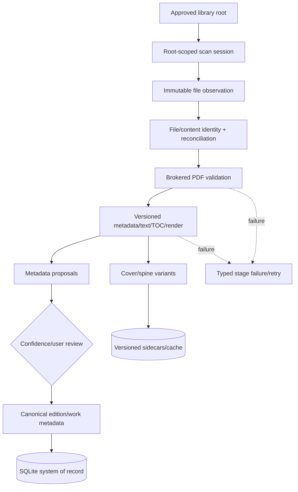
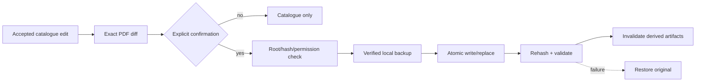
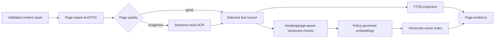
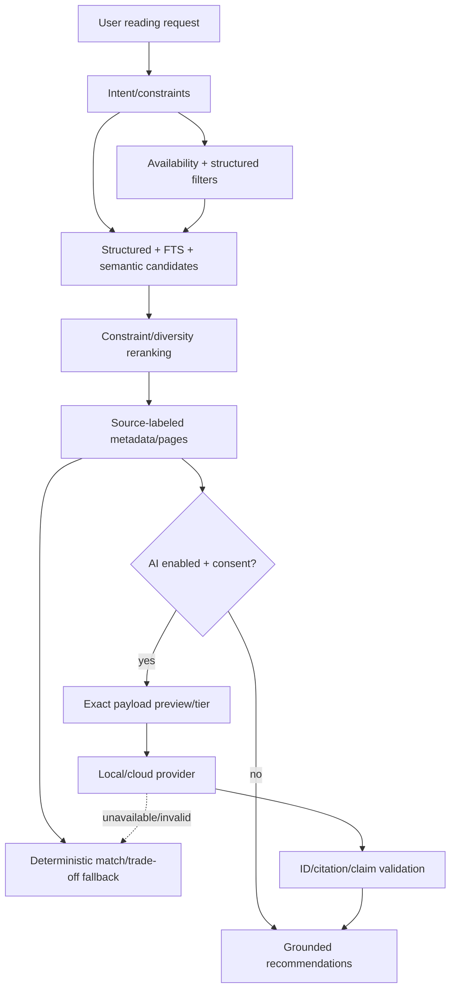
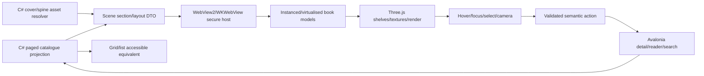
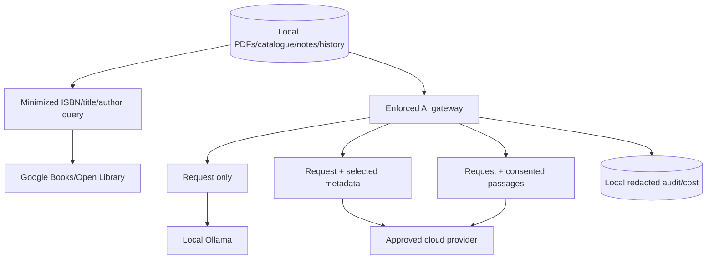
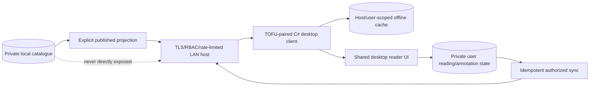

# Data Flows

> Part of the canonical [August 39-phase desktop roadmap](../README.md).

## PDF Ingestion

No unsuccessful or incomplete root scan can infer deletion. No proposal modifies an original PDF. Optional writeback is a distinct confirmed flow:

## Content Intelligence

Every derived node carries source hash and producer/config version. Changes create a new compatible projection; old data is removed only after verification.

## AI Advisor

The provider never chooses from the entire unbounded library. Candidate IDs are already catalogue-valid; explanations cannot add books. Core catalogue and retrieval continue without the completion model.

## 3D Shelf

The WebView cannot read arbitrary paths or navigate externally. It receives opaque asset IDs and sanitized display text.

## Privacy and provider egress

Personal notes are excluded from external payloads by default. The privacy centre shows exact provider/tier/payload, retention evidence and delete controls.

## Classroom host/client

Standalone mode does not start `Host`. School-managed AI remains host-side and is restricted to published evidence and policy/quotas.

