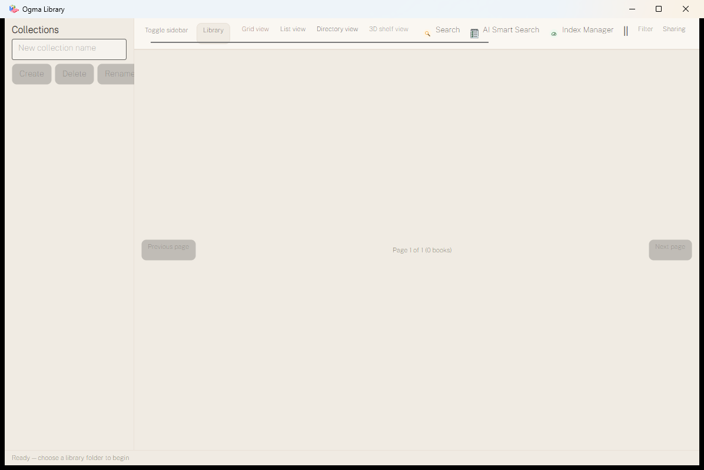
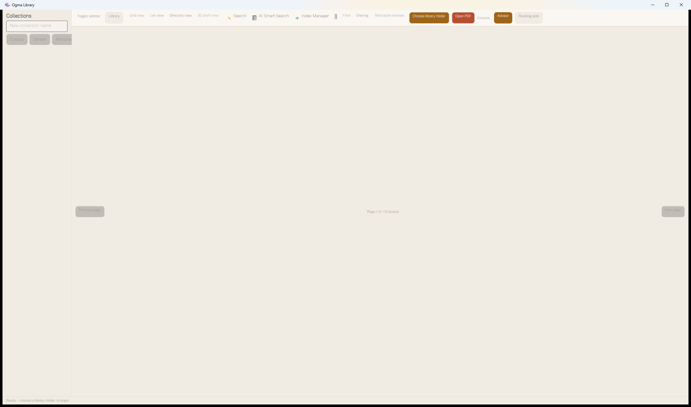
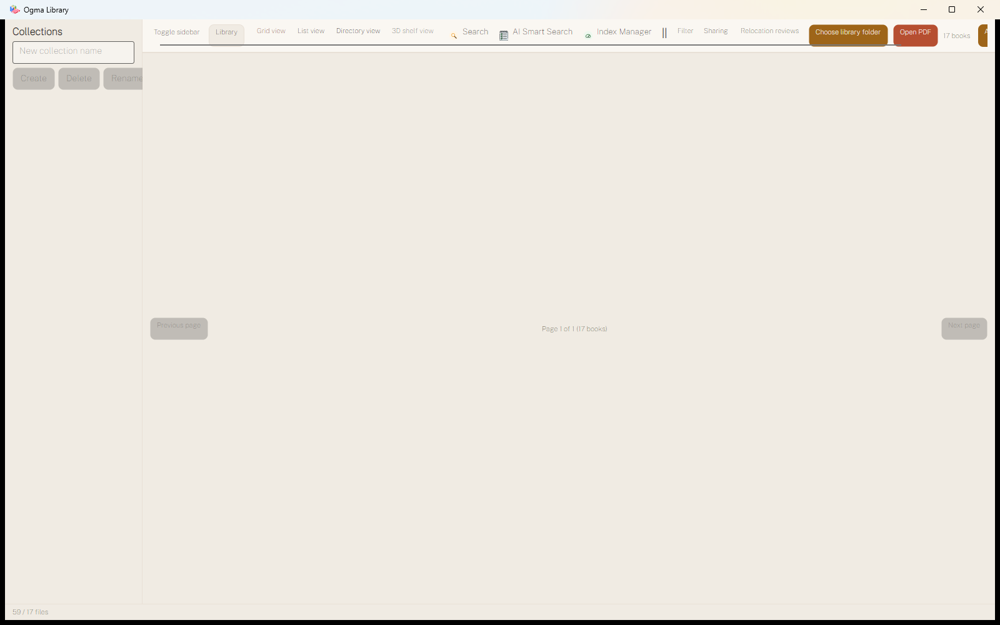
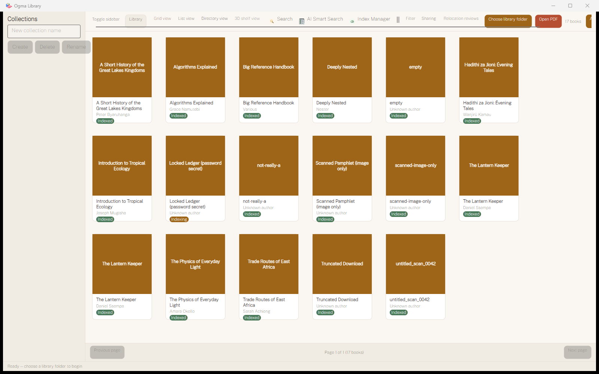
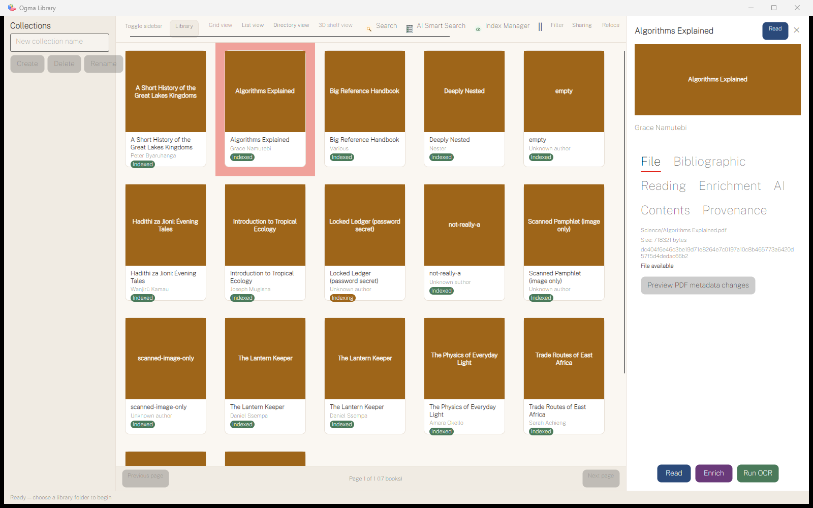
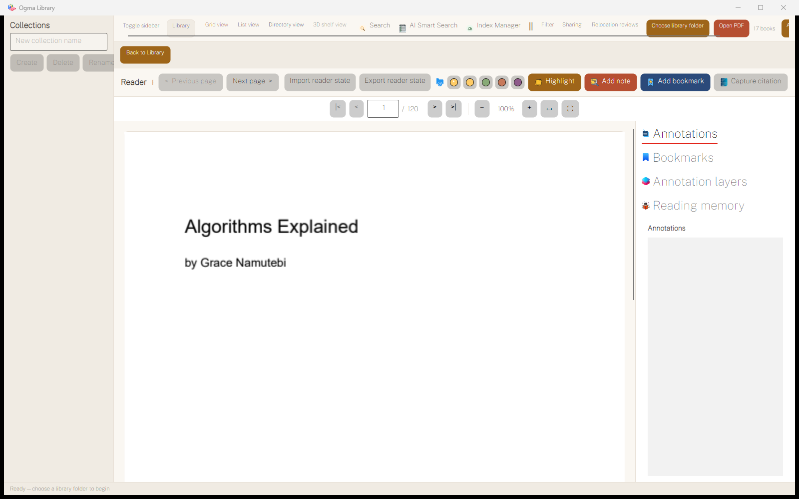
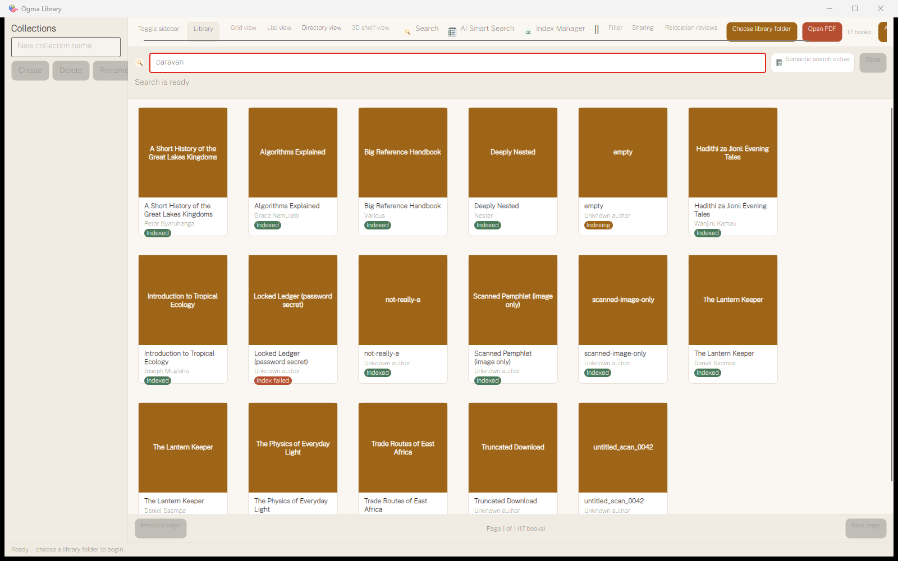
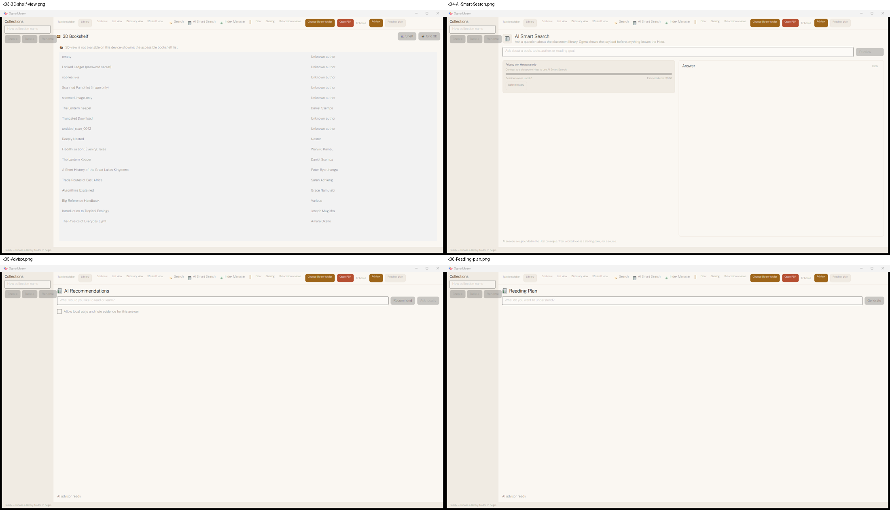
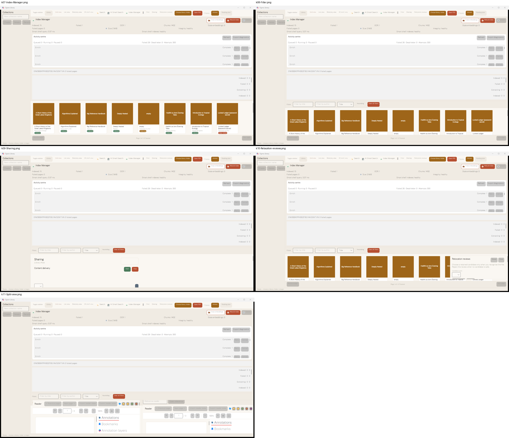
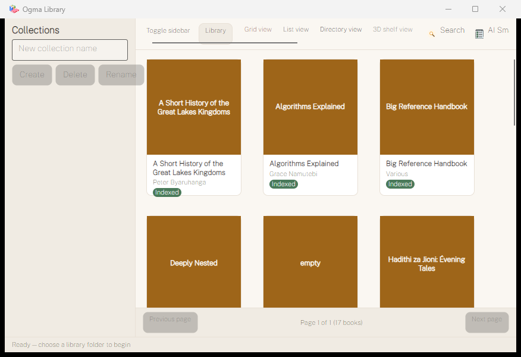

# UI and UX audit (real window, Windows 11)

Date: 25 September 2026. Platform matrix: Windows 11 desktop at 2560×1440, 100 % scaling, light
theme only. macOS, dark theme, the WebView 3D surface and classroom Client mode are
**NOT ASSESSED**.

Engine skills applied:

- `design-system-skills/skills/00-cross-cutting-ops-qa-a11y/product-design-audit`
- `design-system-skills/governance/design-quality-gate.md`
- the Kaizen audit contract in
  `design-system-skills/skills/00-cross-cutting-ops-qa-a11y/design-engine-and-product-improvement`

Evidence classes: **MEASURED** means seen on screen or in the UI Automation tree. **HEURISTIC**
means design judgement. Accessibility tooling and screen-reader passes were not run, so every
accessibility statement below is HEURISTIC or taken from the automation tree.

Screens marked *(patched)* were captured from the scratch build with the pager-overlay fix (K10);
without it, every catalogue screen is blank.

## 1. Screen-by-screen findings

### 1.1 First run (HEAD)



- **MEASURED:** the content area is blank. The empty-state heading, explanation and two
  call-to-action buttons exist in the automation tree but are covered by the pager panel (K10).
  A pager for "Page 1 of 1 (0 books)" floats mid-screen.
- **MEASURED:** at the default 1180×760 size the toolbar is cut off after *Sharing*. The two
  actions a new user needs, *Choose library folder* and *Open PDF*, are off-screen (K11). The
  status bar is the only visible instruction.
- **HEURISTIC:** the collection sidebar shows three disabled buttons before any library exists.
  That is noise on first run, and *Rename* is clipped at the sidebar edge.



At 2200 px the whole toolbar fits. It shows four unrelated button treatments: text links, a filled
beige pill, filled brown and red buttons, and icon-plus-label items. The content is still blank.

### 1.2 Catalogue: broken (HEAD) and fixed (patched)




**After the fix (MEASURED):**

- Cards render in a 6-column grid.
- Every cover is a flat brown placeholder with a white title, although 12 real covers exist (K20).
  Seventeen identical brown tiles give no visual scanning cue, and the title is printed twice per card.
- *Indexed* badges sit on files that are not books: `empty`, `not-really-a`, `Truncated Download` (K21).
- The duplicate *The Lantern Keeper* appears twice with nothing to say so.

**HEURISTIC:**

- The badge is the only colour on the card and carries no useful meaning for readers. "Indexed" is
  an engineering state.
- The grid leaves a wide empty gutter on the right instead of reflowing its column width.
- The status bar still says "Ready — choose a library folder to begin" (K13).

### 1.3 Book detail panel *(patched)*



- **MEASURED:** the seven tab headers (File, Bibliographic, Reading, Enrichment, AI, Contents,
  Provenance) render at about 28 px and wrap onto three rows. That takes more space than the content.
- **MEASURED:** *Read* appears twice, top right and bottom. *Enrich* (purple) and *Run OCR*
  (green) use colours that exist nowhere else.
- **MEASURED:** the raw SHA-256 hash and the relative file path are the first content a reader
  sees. The only action in the tab is *Preview PDF metadata changes*, an advanced write-back
  operation (K81).
- **MEASURED:** the selected card is outlined in a salmon red that is not in the palette.
- **Owner complaint status (right panel overhaul, astra F14):** still **open**. The Sept-14 change
  adjusted width, title and cover only.

### 1.4 Reader *(patched)*



- **MEASURED:** three toolbars stack: *Back to Library*; *Reader* with navigation, import/export,
  highlight colours, *Highlight*, *Add note*, *Add bookmark* and *Capture citation*; then a second
  page-navigation and zoom row. *Previous page* / *Next page* is duplicated as `|<  <  >  >|`.
- **MEASURED:** the library toolbar and collection sidebar stay visible while reading, so about a
  third of the window is chrome.
- **MEASURED:** the page text is soft or blurry at 100 % (K33).
- **MEASURED:** the side-panel tabs (Annotations, Bookmarks, Annotation layers, Reading memory)
  are again display-size.
- **MEASURED:** after about 20 page turns the application crashed (K30). A reader that closes the
  whole app is the single worst UX defect.
- **HEURISTIC:** annotation actions are loud, filled coloured buttons competing with navigation.
  Reading, the primary task, has the least visual priority.

### 1.5 Search *(patched)*



- **MEASURED:** the search box has a red border (the focus style looks like an error). A
  "Semantic search active" chip sits beside it although semantic search is unavailable (K41).
- **MEASURED:** results appear in a separate list above the grid, and the grid stays underneath.
  It is unclear what is a result and what is the library.
- **MEASURED:** multi-word, typo, Unicode and field queries return nothing (K40). The empty result
  gives no suggestion ("try fewer words", "search inside books").

### 1.6 3D shelf, AI Smart Search, Advisor and Reading plan *(patched)*



- **3D shelf (MEASURED):** "3D view is not available on this device" on a capable machine (K60).
  The fallback is a plain two-column text list, which is acceptable as an accessible alternative
  but not as the default experience.
- **AI Smart Search (MEASURED):** offered in standalone mode and then says "Connect to a classroom
  Host" (K17). Cost "$0.00" and token counters are shown for a feature that cannot run.
- **Advisor and Reading plan (MEASURED):** a large empty canvas with an input and a button, then
  "AI advisor unavailable: AI features are disabled" (K50). The page never explains how to enable
  AI, and no settings screen exists to do so.

### 1.7 Index Manager, Filter, Sharing, Relocation reviews and Split view *(patched)*



- **MEASURED:** these panels **stack**. After opening each in turn, Index Manager, Filter, Sharing
  and Split view were all on screen and the catalogue was reduced to one strip (K12).
- **Index Manager / Activity Centre (MEASURED):** a dense engineering dashboard. It shows raw
  book IDs ("01M3BBKPPH9D2F90JYAVG0WTVN: 0 failed pages"), "Failed: 26 · Attempts: 300", and
  repeated *Enrich · Complete* rows with disabled Retry/Cancel buttons. There is no plain-language
  summary of whether the library is healthy.
- **Sharing (MEASURED):** a title, an empty box, *Start* and *Stop* with no explanation, and a
  lone dropdown (K61).
- **Relocation reviews (MEASURED):** a floating card over the grid, which is fine; the empty
  message is clear.
- **Split view (MEASURED):** two empty readers ("/ 0") and a *Reference reader* text box that
  expects a raw book ID.

### 1.8 Narrow window (800×600, patched)



- **MEASURED:** only 8 of about 20 toolbar controls are reachable, and there is no overflow menu.
  The sidebar keeps its full width, and *Rename* overflows into the content area. Cards stay at a
  fixed 160 px, so only three columns fit.

## 2. Cross-cutting design findings

### 2.1 Typography (HEURISTIC, verified tokens)

- **Faces are compliant.** Spectral (display), Public Sans (body) and JetBrains Mono, embedded with
  OFL licences (`Themes/Tokens.axaml:134-136`). None is on the design engine's ban list, and the
  pairing is deliberate.
- **Scale fails the doctrine.** Caption is 11 px, below the 12 px floor. Body, BodyMedium and
  Subtitle (14, 15, 16) step far below the 1.25 ratio, so hierarchy comes from colour and weight
  rather than size. Tab headers misuse a display size.
- **Drift:** 21 hard-coded `FontSize` literals in Views (including 3 and 4 px for a text-glyph QR
  code in `CatalogueShellView.axaml:590` and `SharingSettingsView.axaml:687`). Georgia at 6–7 px on
  3D spines (`src/shelf3d/src/scene.ts:522`).
- **Spectral** ships only Regular and SemiBold, which limits display contrast.

### 2.2 Colour and contrast

- The accent family (oak brown, clay red, sage, plum, slate, ink) is warm and distinctive, but is
  used without roles. Brown means "primary action", "cover placeholder" and "Advisor" at the same
  time.
- The selection colour (salmon) and the search focus (red) read as error states.
- Disabled buttons are grey text on grey fill. That is likely below 3:1 for boundaries
  (NOT ASSESSED numerically).
- There are five hard-coded `Foreground="White"` on badges.

### 2.3 Buttons and controls

At least **four button variants** coexist in one toolbar: flat text, bordered pill, filled accent,
and icon plus label with a mismatched icon size. There is no documented primary, secondary,
tertiary or destructive hierarchy, and more than one primary action competes on most screens.

### 2.4 Iconography

Icons are tiny (about 12 px), mixed in style and inconsistently present. Split view is a literal
`||`. The owner asked on record for "a beautiful app … buttons and menus must have colourful icons
… I will buy premium PNG icons". This is **not delivered**; decision D-07 covers it.

### 2.5 Hierarchy and information architecture

- There is no persistent primary navigation. Twenty peer-level controls sit in one row, mixing
  views (Grid, List, Directory, 3D), destinations (Advisor, Reading plan, Sharing), tools (Index
  Manager, Relocation reviews), actions (Choose folder, Open PDF) and toggles (Filter, Split).
- Panels are not mutually exclusive (K12).
- There is no settings or preferences destination (K16).

### 2.6 States: empty, loading, error, offline

- The first-run empty state is designed but invisible (K10).
- There is no "no matches for this filter" state; a persisted filter silently hides books.
- Errors show raw exception text or nothing (the search task swallows exceptions). A reader
  failure crashes the app.
- Processing states are engineering words: *Indexed*, *Indexing*, *Index failed*.
- Offline or unavailable capabilities (semantic search, AI, 3D, Host) are shown as if available.

### 2.7 Responsiveness and window chrome

The toolbar does not reflow. The sidebar does not collapse automatically. Cards are fixed width.
The minimum usable width is about 1750 px for full access. Whether window size and position are
remembered is NOT ASSESSED.

### 2.8 Accessibility (HEURISTIC; screen readers NOT ASSESSED)

- Catalogue and search items expose C# record dumps as accessible names (K14).
- Off-screen toolbar controls are still in the automation tree but not reachable by pointer.
- Keyboard-only traversal, focus visibility, 200 % zoom and a screen-reader pass are
  **NOT ASSESSED** and assigned to Phase 21.

### 2.9 Owner's recorded complaints

| Complaint | Sept-14 action | Status now |
|---|---|---|
| Command palette distracting and impossible to close (astra F01) | Binding repaired and close button added (`157e49f`) | **Partially verified.** The palette did not appear uninvited in any run. Opening and closing it was NOT ASSESSED (no keystroke injection). The close label is hard-coded English. |
| Right panel poor and needs an overhaul (astra F02/F14) | Visibility binding fixed; width, title and cover tweaks | **Open.** The panel appears only on selection (good), but its content and tab design are unchanged (§1.3). |
| "Beautiful app with colourful icons" | Text labels added to controls | **Open** (D-07) |

## 3. Scores

### 3.1 Kaizen audit contract (12 dimensions, 0–4)

| # | Dimension | Score | Basis |
|---|---|---|---|
| 1 | User value and task clarity | 1 | The core task (see and open my books) fails at HEAD |
| 2 | Narrative and information flow | 1 | Flat 20-item toolbar; stacking panels |
| 3 | Visual hierarchy and readability | 1 | Chrome dominates; duplicate titles and actions |
| 4 | Typography and legibility | 2 | Good faces; broken scale; oversized tabs; blurry page raster |
| 5 | Colour and contrast | 1 | Accents without roles; error-coloured selection and focus |
| 6 | Accessibility and inclusive alternatives | 1 | Record-dump names; unreachable controls; 3D fallback exists |
| 7 | Interaction states and correction | 1 | Invisible empty state; silent errors; crash |
| 8 | AI disclosure, control and drift | 1 | Fails closed (good) but mislabels availability and gives no route to enable |
| 9 | Performance and responsive stability | 1 | 11.4 s stall; crash; clipped toolbar |
| 10 | Consistency and token reuse | 1 | Four button styles; 21 font-size literals; hard-coded colours |
| 11 | Provenance and rights | 2 | Fonts licensed and documented; icon licence evidence not re-checked |
| 12 | Handoff and reproducibility | 2 | Tokens and themes exist; no design spec for shell or navigation |
| | **Total** | **15 / 48** | |

```
raw_diagnostic_score: 31
reported_audit_score: 31        # min(raw, 65)
confidence: medium              # real-window evidence; no AT or macOS evidence
hard_gates: blocked             # accessibility gate failed (HEURISTIC), performance gate failed (MEASURED crash/stall)
```

### 3.2 Product-design-audit dimensions (desktop lens)

| Dimension (weight) | 0–4 | Gate |
|---|---|---|
| AI-slop gate (4) | 3 | Pass (HEURISTIC): compliant faces, authored palette |
| Hierarchy (15) | 1 | |
| Accessibility (20) | 1 | **Fail**, which caps the score at ≤ 59 |
| Typography (10) | 2 | |
| Colour (8) | 1 | |
| Layout (8) | 1 | |
| Interaction states (12) | 1 | |
| Motion (5) | NOT ASSESSED | |
| Content and UX writing (12) | 1 | |
| Performance (6) | 0 | **Fail** (crash, stall), which caps the score at ≤ 74 |
| IA / navigation | 1 | |
| Trust | 1 | Misleading capability labels |

Band: **< 40, fundamental issues**. Two gate failures apply; both caps are above the raw score.

## 4. Routing to phases

| Finding | Phase | Primary design skill |
|---|---|---|
| Pager overlay, empty state, status truth | 03 | `empty-error-and-loading-states`, `onboarding-and-first-run-design` |
| Toolbar, stacking panels, IA, settings route | 07, 08 | `webapp-gui-design`, `heuristic-evaluation-and-design-critique` |
| Type scale, tokens, buttons, colour roles, icons, dark theme | 09 | `design-tokens-and-naming`, `component-states-and-interaction-fidelity`, `iconography-system-design` |
| Cards, covers, badges, duplicates | 10 | `webapp-gui-design` |
| Detail inspector | 11 | `webapp-gui-design`, `error-empty-and-system-messaging` |
| Reader chrome and focus mode | 12 | `webapp-gui-design` |
| Search result presentation | 13 | `empty-error-and-loading-states` |
| Activity Centre plain-language health | 06, 10 | `dashboard-and-data-product-design` |
| Accessibility pass | 21 | `accessibility-wcag-2-2-compliance` |
| Final ship gate | 28 | `design-qa-and-pre-launch-review` |

Skill paths are listed in full in [07-skills-engine-routing.md](07-skills-engine-routing.md).
