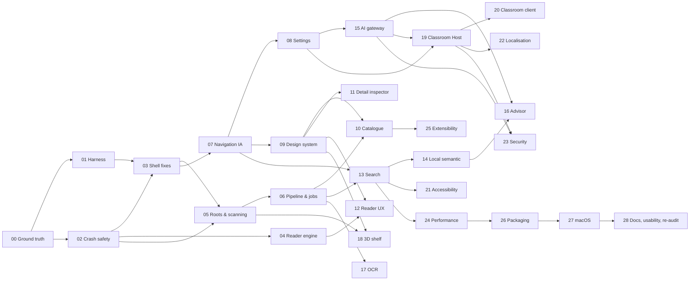

# Sept-23 Kaizen master remediation plan: 29 phases

Owner: Peter Bamuhigire (Chwezi Core Systems). Prepared 25 September 2026 from the audit in this
folder. The goal is to make Ogma Library **work the way the owner expects on a real screen**, and
only then prove that with release evidence.

## 1. Planning principles

These principles come from the failure patterns in
[06-prior-plans-reconciliation.md](06-prior-plans-reconciliation.md) and the engine doctrine in
[07-skills-engine-routing.md](07-skills-engine-routing.md).

1. **The window is the oracle.** No phase closes on unit tests alone. Every phase that touches
   behaviour must pass its golden journeys in the real application window through the Phase 01
   harness, at 1280×800 and 1920×1080, with before and after screenshots stored in
   `docs/implementation/execution/evidence/sept-23-kaizen/phase-NN/`.
2. **Working software before paperwork.** Evidence is proportionate: one completion record per
   phase listing commands run, results, screenshots and open `NOT ASSESSED` items. Do not generate
   large evidence volumes for small changes.
3. **One execution sequence.** This plan becomes the execution order. The Aug-39 roadmap remains
   the **requirement accountability** authority (FR/NFR/CTRL → phase matrix). Every phase below
   names the FR/NFR IDs it moves, and Phase 00 amends `docs/plans/aug-39/README.md` and
   `CLAUDE.md` to record this. The astra 21-phase plan and the Sept-10 Kaizen are superseded as
   execution plans and remain history.
4. **Fix the root, then the symptom.** Each defect row names its root cause. Stopgaps (like the
   Sept-14 toolbar scroll) are allowed only when labelled as stopgaps, and each must have a
   follow-up phase.
5. **Small reversible slices.** Each phase ships in slices of one or a few commits (Conventional
   Commits plus DCO sign-off). Each slice has a rollback. Standardise only after acceptance evidence.
6. **NOT ASSESSED is never a pass.** Physical, platform, signing, provider and assistive-technology
   gates stay open, each with an owner, until measured.
7. **Owner-visible progress.** At the end of every wave, run a 20–30 minute owner walkthrough of
   the golden journeys on the real build, and record the owner's verdict in the wave record.

## 2. Waves and phases

| Wave | Outcome the owner can see | Phases |
|---|---|---|
| **A. Stabilise** | The repo builds; the app shows the library, does not crash while reading, and failures are logged. | 00–04 |
| **B. Core library** | Folders, scanning, covers, file validity and background processing behave correctly; everything is reachable; settings exist. | 05–08 |
| **C. Experience** | A coherent, beautiful and consistent UI, catalogue, detail inspector and reader. | 09–12 |
| **D. Search and AI** | Search finds what is in the books; semantic search is available locally; the Advisor works with a provider or offline. | 13–17 |
| **E. Advanced surfaces** | 3D shelf and classroom Host/Client work from the UI. | 18–20 |
| **F. Quality attributes** | Accessibility, localisation, security, performance and reliability meet their gates. | 21–24 |
| **G. Ship** | Extensibility decisions, installers, macOS parity, documentation, usability test and re-audit. | 25–28 |

### Phase catalogue

Sizes are indicative focused engineering days for one experienced engineer with AI assistance;
they exclude owner and external wait time. Defect IDs refer to
[03-defect-register.md](03-defect-register.md).

| # | Phase | Primary defects | Key FR/NFR | Depends on | Size |
|---|---|---|---|---|---|
| 00 | [Ground truth, repository and toolchain recovery](phases/phase-00-ground-truth-and-repo-recovery.md) | K01 K02 K03 K04 K06 K91 | NFR-OGMA governance | — | 2–3 d |
| 01 | [Real-window acceptance harness and golden journeys](phases/phase-01-real-window-acceptance-harness.md) | K05 K14 | UX-007, NFR test gates | 00 | 5–7 d |
| 02 | [Crash safety, logging and threading foundation](phases/phase-02-crash-safety-logging-threading.md) | K31 K07 K72 K70 | NFR reliability, CTRL audit | 00 | 4–6 d |
| 03 | [Shell emergency fixes: visible catalogue and truthful status](phases/phase-03-shell-emergency-fixes.md) | K10 K11 (stopgap) K13 | UX-001, UX-002, CAT-001 | 01, 02 | 2–3 d |
| 04 | [Reader engine stability and page rendering](phases/phase-04-reader-engine-stability.md) | K30 K32 K33 | READ-001..003, NFR perf | 02 | 5–7 d |
| 05 | [Library roots, scanning and file validity](phases/phase-05-library-roots-scanning-validity.md) | K20 K21 K22 K27 K28 | LIB-001..007 | 02, 03 | 6–8 d |
| 06 | [Processing pipeline, jobs and identity promotion](phases/phase-06-processing-pipeline-and-jobs.md) | K23 K24 K25 K26 K13 K28 | LIB-005, META-001, CAT-007 | 05 | 6–9 d |
| 07 | [Navigation and information architecture](phases/phase-07-navigation-and-information-architecture.md) | K11 K12 K17 | UX-003, UX-005 | 03 | 6–8 d |
| 08 | [Settings and capability centre](phases/phase-08-settings-and-capability-centre.md) | K16 K17 | UX-004, UX-008, META-002, AI-001 | 07 | 5–7 d |
| 09 | [Design system and visual identity](phases/phase-09-design-system-and-visual-identity.md) | K15 | UX-008, NFR a11y contrast | 07 | 7–10 d |
| 10 | [Catalogue experience](phases/phase-10-catalogue-experience.md) | K14 K20 K23 | CAT-001..007, META-007/008 | 06, 09 | 7–10 d |
| 11 | [Book detail inspector overhaul](phases/phase-11-book-detail-inspector.md) | K15 K81 | CAT-004, META-003..006 | 09 | 5–7 d |
| 12 | [Reader experience](phases/phase-12-reader-experience.md) | K34 K33 | READ-002..015 | 04, 09 | 8–12 d |
| 13 | [Unified, trustworthy search](phases/phase-13-unified-search.md) | K40 K41 K14 | SEARCH-001..006 | 06, 07 | 6–8 d |
| 14 | [Local semantic capability and embeddings](phases/phase-14-local-semantic-capability.md) | K42 K25 | AI-006, SEARCH-004/005 | 13, D-05 | 5–8 d |
| 15 | [AI gateway, providers and Privacy Center](phases/phase-15-ai-gateway-and-privacy-center.md) | K50 | AI-001..005, AI-009..011 | 08, D-06 | 6–9 d |
| 16 | [Reading Advisor, grounded answers and reading plans](phases/phase-16-advisor-and-reading-plans.md) | K50 | AI-003, AI-007, AI-008 | 14, 15 | 7–10 d |
| 17 | [OCR and extraction quality](phases/phase-17-ocr-and-extraction-quality.md) | K21 K25 K04 | READ-010, META-001 | 06 | 4–6 d |
| 18 | [3D bookshelf](phases/phase-18-3d-bookshelf.md) | K60 K20 | CAT-001 (3D) | 05, 09 | 6–9 d |
| 19 | [Classroom Host and school administration](phases/phase-19-classroom-host-and-admin.md) | K61 K51 | LAN-001..010, ADMIN-001..013 | 08, 15 | 8–12 d |
| 20 | [Classroom client, offline cache and sync](phases/phase-20-classroom-client-and-sync.md) | K61 K62 | CLIENT-001..013 | 19 | 7–10 d |
| 21 | [Accessibility](phases/phase-21-accessibility.md) | K14 K15 | UX-005, NFR a11y | 09–13 | 5–8 d |
| 22 | [Localisation and product copy](phases/phase-22-localisation-and-copy.md) | K16 K61 K81 | UX-004 | 08, 19 | 4–6 d |
| 23 | [Security and privacy hardening](phases/phase-23-security-and-privacy-hardening.md) | K80 K70 K27 K82 | CTRL-001..032 | 05, 15, 19 | 6–10 d + external review |
| 24 | [Performance, reliability and scale](phases/phase-24-performance-reliability-scale.md) | K71 K26 K04 | NFR-PROD perf budgets | 06, 13 | 6–9 d |
| 25 | [Extensibility and imports](phases/phase-25-extensibility-and-imports.md) | K90 (EXT) | EXT-001..003 | 10, D-10 | 4–8 d or defer |
| 26 | [Packaging, installers and signing](phases/phase-26-packaging-installers-signing.md) | K06 K92 | NFR distribution | 24, D-08 | 6–9 d + certificates |
| 27 | [macOS parity and cross-platform acceptance](phases/phase-27-macos-parity.md) | K92 K82 | all platform NFRs | 26, Mac hardware | 6–10 d |
| 28 | [Documentation, in-app help, beta usability test and re-audit](phases/phase-28-docs-usability-and-reaudit.md) | K90 K91 | UX-006, UX-007 | all | 7–10 d + participants |

Indicative total: about 170–245 engineering days, excluding external waits (certificates, Mac
hardware, independent security review, usability participants). Waves A–C (phases 00–12) are
about 70–100 days and deliver a product the owner can use daily for standalone reading.

### Dependency graph

Phases on different branches of the graph can run in parallel once their prerequisites close. The
critical path to a usable standalone product is 00 → 01/02 → 03 → 05 → 06 → 10/13, with 04 → 12
alongside.

## 3. Owner decisions needed

Each decision blocks only the phases listed. The recommended option is first.

| ID | Decision | Options (recommended first) | Blocks |
|---|---|---|---|
| D-01 | Were the uncommitted deletions of `tests/OgmaLibrary.Tests` and `tests/OgmaLibrary.Tests.Ui` intentional? | **Restore from HEAD** (`git restore tests/`); or remove both from `OgmaLibrary.sln` and plan replacement suites | 00 |
| D-02 | Plan authority | **Sept-23 Kaizen = execution sequence; Aug-39 matrix = requirement accountability**; or keep Aug-39 phases as the sequence | 00 |
| D-03 | Multiple library folders | **Support several roots, with add/remove/enable in Settings** (the backend already has `AddAsync`); or keep a single root with an explicit "replace library folder" warning | 05 |
| D-04 | Where derived covers, spines and caches live | **App-data folder by default, with an opt-in "portable library" sidecar mode**; or keep `.ogma/` inside the library with a disclosure | 05 |
| D-05 | Local semantic engine | **Bundle a small local ONNX embedding model** (no extra install); or guided Ollama setup; or keep semantic search off by default | 14 |
| D-06 | AI providers for the Advisor | **One cloud provider plus local-only mode first**, with exact model IDs confirmed by the Phase 15 currentness review; or local-only | 15, 16 |
| D-07 | Icon set | **Buy the premium colourful PNG/SVG set you asked for (licence recorded)**; or commission; or an open-licence set | 09 |
| D-08 | Installer technology | **Keep accepted ADR-0009: Velopack for direct Windows/macOS channels (delta updates, signed), MSIX for Store/enterprise, Developer ID-signed and notarised DMG**; or supersede ADR-0009 with a new ADR | 26 |
| D-09 | Classroom clients storing full PDFs | **Stream with a bounded, encrypted, expiring cache**; or keep full copies with teacher consent | 20 |
| D-10 | Extensibility scope for v1 | **Defer the plugin loader and local API; ship Calibre/Zotero import only**; or the full EXT set; or defer everything | 25 |
| D-11 | Teacher dashboard (CLIENT-012) in v1 | **Minimal dashboard (who is connected, what is published)**; or defer | 20 |
| D-12 | Beta cohort | **20 participants across home readers, students and teachers**, recruited by the owner | 28 |

## 4. Score trajectory

The first audit publishes `min(raw, 65)` (engine doctrine). This audit's raw diagnostic is **30/100**
(see [01-audit-report.md](01-audit-report.md)). Later re-audits may exceed 65 only with
executable and rendered evidence of the same class. Targets are expectations to test, not claims.

| Checkpoint | Target (astra 10-dimension index) | Hard gates that must hold |
|---|---|---|
| Baseline (today) | 30 | — (blocked) |
| End of wave A | ≥ 50 | Zero P0 crashes in the golden journeys; catalogue visible |
| End of wave B | ≥ 62 | Every golden journey completes unassisted in the harness |
| End of wave C | ≥ 72 | Design quality gate passes; owner walkthrough accepted |
| End of wave D | ≥ 80 | Search oracle and AI evaluation thresholds met |
| End of wave E | ≥ 85 | Two-machine classroom journey measured |
| End of wave F | ≥ 90 | WCAG 2.2 AA with keyboard and one screen reader measured; security review closed |
| End of wave G | 95 (conditional) | Signed installers on both OSs; 190 of 200 usability tasks succeed unassisted; owner sign-off |

## 5. Definition of Done (every phase)

A phase is **COMPLETE** only when all of these hold:

1. Every task in the phase document is done or explicitly moved to a named later phase, with a reason.
2. The full gate set passes on a clean checkout:
   `./scripts/Test-RequirementAccountability.ps1`, `dotnet restore --locked-mode`,
   `dotnet format --verify-no-changes`, the Release build, the vulnerable-package scan, the analyzers,
   and `dotnet test` (fast suite). Also the `shelf3d` npm gates when `src/shelf3d` changed, and the
   real-window journey suite from Phase 01.
3. New behaviour has tests at the right layer (unit, headless UI, real-window) that failed before
   the fix and pass after it.
4. The golden journeys touched by the phase have before and after screenshots at both reference
   sizes, and the owner can see the change.
5. User-facing strings are localised (en, fr); no hard-coded colours or font sizes are introduced;
   accessible names are meaningful.
6. The completion record exists at
   `docs/implementation/execution/phase-sept23-NN-completion.md`, listing commands, results,
   evidence paths, `NOT ASSESSED` items with owners, and the rollback point (commit hash).
7. `docs/implementation/execution/00-execution-status.md` and the status register in
   [README.md](README.md) are updated.

## 6. Phase document template

Every file in [`phases/`](phases/) uses this structure:

1. **Header**: wave, size, dependencies, owner decisions, primary defects, requirement IDs.
2. **Why this phase exists**: the user-visible problem, in plain language, with the measured evidence.
3. **Objectives and exit criteria**: measurable.
4. **Skills to load before starting**: exact engine paths.
5. **Scope in / scope out.**
6. **Work breakdown**: numbered tasks with file-level targets. Each task has an acceptance check.
7. **Kaizen action rows**: gap | root cause | change | hypothesis | measure (before → target) | evidence | risk | rollback.
8. **Test plan**: unit, headless UI, real-window journeys, negative and failure cases.
9. **Acceptance commands**: exact commands to run.
10. **NOT ASSESSED and external dependencies**, each with an owner.
11. **Risks and mitigations.**
12. **Execution prompt**: a ready-to-paste brief for an implementing agent, following the
    `chwezi-dev-engine/skills/execution-plan-scripts` prompt anatomy.
